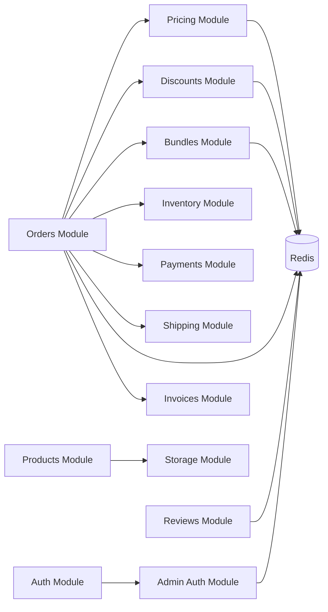

# Cross-Module Dependencies

This document covers both **module-level dependencies** (within the backend) and **workspace-level dependencies** (across the monorepo).

## Workspace Dependencies

### Monorepo Dependency Graph

```mermaid
graph TD
    Admin[Admin App] --> DB[@vcecom/db]
    Backend[Backend App] --> DB
    Storefront[Storefront App] --> DB
    
    Admin --> TSConfig[@vcecom/typescript-config]
    Backend --> TSConfig
    Storefront --> TSConfig
    Docs[Docs App] --> TSConfig
    
    Backend --> Admin[via REST API]
    Backend --> Storefront[via REST API]
```

### Shared Package Usage

#### `@vcecom/db` Package

**Purpose**: Shared database schema, migrations, and type-safe database operations

**Used By**:
- `apps/backend` - All database operations
- Future: `apps/admin` - Type-safe API client types
- Future: `apps/storefront` - Type-safe API client types

**Usage Example**:
```typescript
// In apps/backend
import { db } from '@vcecom/db';
import { products, productVariants } from '@vcecom/db/schema';

// Type-safe database queries
const product = await db.query.products.findFirst({
  where: eq(products.id, productId),
  with: { variants: true }
});
```

#### `@vcecom/typescript-config` Package

**Purpose**: Shared TypeScript configurations for consistency

**Used By**:
- All apps (`admin`, `backend`, `storefront`, `docs`)

**Configuration Files**:
- `base.json` - Base TypeScript configuration
- `nextjs.json` - Next.js-specific configuration
- `react-library.json` - React library configuration

### Workspace Protocol

Internal dependencies use the `workspace:*` protocol:

```json
{
  "dependencies": {
    "@vcecom/db": "workspace:*",
    "@vcecom/typescript-config": "workspace:*"
  }
}
```

**Benefits**:
- Automatic linking between workspaces
- Single source of truth for internal packages
- No version conflicts
- Fast local development

### Dependency Management Best Practices

1. **Use Workspace Protocol**: Always use `workspace:*` for internal packages
2. **Explicit Exports**: Only export what's needed from shared packages
3. **Type Safety**: Leverage shared types from `@vcecom/db`
4. **No Direct Imports**: Don't import from other apps directly
5. **API Communication**: Apps communicate via REST APIs, not direct imports

## Module Dependency Graph



## Critical Dependencies

### Orders Module Dependencies

The Orders module has the most dependencies as it orchestrates the checkout and order creation flow:

1. **Pricing Module**: Calculates base prices for order items
2. **Discounts Module**: Applies eligible discounts
3. **Bundles Module**: Calculates bundle pricing
4. **Inventory Module**: Reserves inventory for order
5. **Payments Module**: Creates payment intent
6. **Shipping Module**: Calculates shipping costs
7. **Invoices Module**: Generates invoice after order creation

### Pricing Module Dependencies

- **Redis Store Module**: Caches pricing snapshots and price lists
- **Database**: Stores price lists and customer groups

### Discounts Module Dependencies

- **Redis Store Module**: Caches discount rules and eligibility data
- **Database**: Stores discount definitions and rulesets

### Bundles Module Dependencies

- **Redis Store Module**: Caches bundle definitions and eligibility
- **Database**: Stores bundle definitions

## Circular Dependencies

Currently, there are **no circular dependencies** between modules. All dependencies flow in one direction:

```
AppModule
  └── Core Modules (Auth, Products, etc.)
  └── Business Logic Modules (Pricing, Discounts, Bundles)
  └── Orchestration Modules (Orders)
  └── Infrastructure Modules (Redis, Storage)
```

## Shared Services

### Redis Store Service

Used by multiple modules for caching:
- Pricing snapshots
- Discount rules
- Bundle definitions
- Cart data
- Checkout sessions
- Inventory reservations
- Review aggregations

### Context Service

Used by all modules for:
- Request-scoped context (IP, user agent, request ID)
- Activity logging
- Trace correlation

### Logger Service

Used by all modules for:
- Structured logging
- Request correlation
- Error tracking

## Dependency Injection Pattern

All modules use NestJS dependency injection:

```typescript
// Example: OrdersService depends on PricingService
@Injectable()
export class OrdersService {
  constructor(
    private readonly pricingService: PricingService,
    private readonly discountsService: DiscountsService,
    private readonly bundlesService: BundleDefinitionService,
  ) {}
}
```

## Module Exports

Modules export services that other modules depend on:

```typescript
// PricingModule exports
@Module({
  exports: [
    PricingService,
    PricingEngine,
    PricingSnapshotService,
  ],
})
export class PricingModule {}
```

## Best Practices

### Module-Level Dependencies

1. **Explicit Dependencies**: All dependencies declared in module imports
2. **Service Exports**: Only export services that other modules need
3. **No Circular Dependencies**: Maintain one-way dependency flow
4. **Shared Infrastructure**: Use common modules (Redis, Storage) for shared resources
5. **Lazy Loading**: Consider lazy loading for optional dependencies

### Workspace-Level Dependencies

1. **Workspace Protocol**: Use `workspace:*` for all internal package dependencies
2. **Shared Packages**: Put reusable code in `packages/`, not duplicated across apps
3. **Type Safety**: Leverage shared types from `@vcecom/db` for consistency
4. **API Boundaries**: Apps communicate via REST APIs, not direct code imports
5. **Build Dependencies**: Define proper `dependsOn` in `turbo.json` for build order
6. **Package Exports**: Only export what's needed via `package.json` exports field
7. **Version Consistency**: Keep shared dependencies at same versions across workspaces
