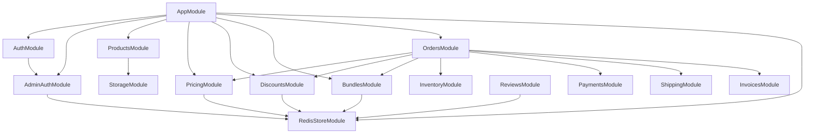

# Module Breakdown

## Core Modules

### Auth Module (`modules/auth`)
- **Purpose**: Customer authentication and session management
- **Key Services**: `AuthService`, `JwtStrategy`
- **Endpoints**: Login, register, refresh token, password reset
- **Dependencies**: `AdminAuthModule` (for JWT strategy)

### Admin Auth Module (`modules/admin-auth`)
- **Purpose**: Secure admin authentication with 2FA and activity logging
- **Key Services**: 
  - `AdminAuthService` - Core authentication logic
  - `AdminSessionsService` - Session management with refresh token rotation
  - `AdminActivityService` - Activity logging
  - `AdminMfaService` - TOTP 2FA support
- **Endpoints**: Login, logout, refresh, session management, 2FA setup
- **Security**: Argon2id password hashing, Redis rate limiting, session validation

### Products Module (`modules/products`)
- **Purpose**: Product catalog management
- **Key Services**: `ProductsService`, `VariantsService`, `ProductImagesService`
- **Endpoints**: CRUD operations for products, variants, images
- **Features**: Image upload, variant management, product status

### Categories Module (`modules/categories`)
- **Purpose**: Hierarchical category management
- **Key Services**: `CategoriesService`
- **Endpoints**: Category CRUD, tree structure
- **Features**: Nested categories, category products

### Customers Module (`modules/customers`)
- **Purpose**: Customer profile and address management
- **Key Services**: `CustomersService`, `AddressesService`
- **Endpoints**: Customer CRUD, address management
- **Features**: Address validation, customer groups

## Pricing & Discounts

### Pricing Module (`modules/pricing`)
- **Purpose**: Flexible pricing system with price lists and customer groups
- **Key Services**:
  - `PricingService` - Core pricing logic
  - `PriceListService` - Price list management
  - `CustomerGroupService` - Customer group management
  - `PricingEngine` - Price calculation engine
  - `PricingSnapshotService` - Snapshot versioning
  - `DriftDetectorService` - Price drift detection
- **Endpoints**: Price calculation, price list CRUD, customer groups
- **Features**: Price lists, customer groups, pricing snapshots, drift detection

### Discounts Module (`modules/discounts`)
- **Purpose**: Deterministic discount engine with priority and stacking
- **Key Services**:
  - `DiscountsService` - Core discount logic
  - `DiscountValidationService` - Discount validation
  - `DiscountEligibilityBuilder` - Eligibility rules builder
  - `DiscountSnapshotValidator` - Snapshot validation
  - `DriftDetectorService` - Discount drift detection
  - `RulesetVersionManager` - Ruleset versioning
- **Endpoints**: Discount CRUD, discount calculation, drift reports
- **Features**: BOGO, tiered, cart discounts, priority rules, stacking, snapshots

## Bundles

### Bundles Module (`modules/bundles`)
- **Purpose**: Configurable product bundles with choice sets
- **Key Services**:
  - `BundleDefinitionService` - Bundle definitions
  - `BundleSetsService` - Choice/option sets
  - `BundleEligibilityService` - Eligibility checking
  - `BundleWarmupService` - Cache warming
- **Endpoints**: Bundle CRUD, bundle pricing, eligibility
- **Features**: Choice sets, option sets, bundle pricing, cart integration

## Commerce

### Orders Module (`modules/orders`)
- **Purpose**: Order creation, fulfillment, and management
- **Architecture**: Service-oriented architecture with specialized services organized by domain
- **Orchestration Layer**:
  - `OrdersService` - Thin orchestrator that delegates to specialized services
- **Creation Services**:
  - `OrderCreationService` - Coordinates order creation flows
  - `OrderPaymentIntentFlowService` - Handles payment intent creation during checkout
  - `OrderPaymentFinalizationService` - Handles order creation from payment webhook
  - `OrderCodFlowService` - Handles Cash on Delivery (COD) order creation
- **Query Services**:
  - `OrderQueryService` - Handles order retrieval and filtering
  - `OrderEnrichmentService` - Enriches order data with related entities
  - `OrderResponseBuilderService` - Builds order response DTOs
- **Status Services**:
  - `OrderStatusService` - Manages order status transitions
  - `OrderTimelineService` - Manages order timeline events
  - `OrderTrackingService` - Provides order tracking information
- **Domain Services** (organized by domain):
  - `services/calculation/` - Order total calculations and GST computation
  - `services/cart/` - Cart processing and validation
  - `services/checkout/` - Checkout orchestration and session management
  - `services/discount/` - Discount application and validation
  - `services/pricing/` - Pricing engine integration
  - `services/payment/` - Payment intent handling
  - `services/persistence/` - Database operations
  - `services/snapshot/` - Pricing and discount snapshot management
  - `services/inventory/` - Inventory operations and reservations
  - `services/validation/` - Order validation logic
- **Endpoints**: Order CRUD, payment intent creation, fulfillment status updates
- **Features**: 
  - Webhook-driven order creation (orders created after payment confirmation)
  - COD flow (bypasses payment intent creation)
  - Payment-scoped idempotency
  - Order status workflow
  - Fulfillment tracking
  - Reconciliation

### Payments Module (`modules/payments`)
- **Purpose**: Payment intent creation and Razorpay integration
- **Key Services**: `PaymentsService`, `RazorpayService`
- **Endpoints**: Payment intent creation, webhook handling
- **Features**: Razorpay integration, payment reconciliation, webhooks

### Shipping Module (`modules/shipping`)
- **Purpose**: Shiprocket and NimbusPost integration
- **Key Services**: `ShippingService`, `ShiprocketService`, `NimbusPostService`
- **Endpoints**: Shipping rate calculation, label generation, tracking
- **Features**: Multi-provider support, rate calculation, tracking

### Invoices Module (`modules/invoices`)
- **Purpose**: GST-compliant invoice generation
- **Key Services**: `InvoicesService`
- **Endpoints**: Invoice generation, download
- **Features**: GST calculation, invoice templates, PDF generation

## Reviews

### Reviews Module (`modules/reviews`)
- **Purpose**: Verified purchase reviews with moderation
- **Key Services**:
  - `ReviewsService` - Core review logic
  - `ReviewModerationService` - Moderation pipeline
  - `ReviewAggregationService` - Review aggregation
  - `ReviewCacheService` - Redis caching
- **Endpoints**: Review CRUD, moderation, aggregation
- **Features**: Verified purchase flow, auto-moderation, aggregation, caching

## Infrastructure

### Redis Store Module (`modules/redis-store`)
- **Purpose**: Centralized Redis client and key pattern management
- **Key Services**: `RedisStoreService`
- **Stores**:
  - `CartStore` - Shopping cart persistence
  - `CheckoutStore` - Checkout session state
  - `InventoryStore` - Inventory reservations
  - `DiscountRuleStore` - Discount rules cache
  - `EligibilityStore` - Eligibility cache
  - `BundleCacheStore` - Bundle cache
  - `ProductMappingStore` - Product mappings
  - `IdempotencyStore` - Idempotency keys
- **Features**: Key patterns, TTL management, Lua scripts

### Storage Module (`modules/storage`)
- **Purpose**: S3-compatible object storage (MinIO/Supabase)
- **Key Services**: `StorageService`
- **Endpoints**: File upload, download, deletion
- **Features**: Multi-provider support, presigned URLs

### Inventory Module (`modules/inventory`)
- **Purpose**: Inventory tracking and reservations
- **Key Services**: `InventoryService`
- **Endpoints**: Inventory queries, reservations
- **Features**: Inventory tracking, reservation system

### Address Autocomplete Module (`modules/address-autocomplete`)
- **Purpose**: Address autocomplete integration
- **Key Services**: `AddressAutocompleteService`
- **Endpoints**: Address search, autocomplete
- **Features**: Address validation, autocomplete

## Common Modules

### Logger Module (`common/logging`)
- **Purpose**: Structured logging with Pino
- **Services**: `PinoLogger`, `ContextService`
- **Features**: Structured logging, request context, correlation IDs

### Tracing Module (`common/tracing`)
- **Purpose**: Distributed tracing with OpenTelemetry
- **Services**: `OtelTracingService`
- **Features**: OTEL spans, Zipkin export, trace correlation

## Module Dependencies

## Module Communication Patterns

### Direct Service Injection
- Services call other services via NestJS dependency injection
- Used for: Order → Pricing, Order → Discounts, Order → Bundles

### Redis-Based Communication
- Shared state via Redis stores
- Used for: Cart data, checkout sessions, inventory reservations

### Database-First Operations
- Direct database access for write operations
- Used for: Order creation, payment processing, inventory updates

