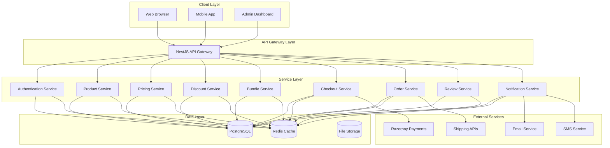

# System Architecture Overview

VCEcom is built using a modular, scalable architecture that separates concerns while maintaining high performance and developer productivity. This document provides a comprehensive overview of the system architecture, design patterns, and technical decisions.

## Monorepo Architecture

VCEcom is organized as a **Turborepo monorepo** using **pnpm workspaces**, enabling efficient code sharing, parallel development, and optimized builds. For detailed information about the monorepo structure, workspace organization, and development workflow, see the [Monorepo Architecture](./monorepo.md) documentation.

**Key Benefits**:
- **Code Reuse**: Shared database schemas and types via `@vcecom/db` package
- **Type Safety**: Consistent TypeScript configurations across all apps
- **Fast Builds**: Turborepo caching and parallel task execution
- **Independent Deployment**: Each app can be deployed separately
- **Developer Experience**: Single command to start all services

**Workspace Structure**:
- **Apps**: `admin` (Next.js), `backend` (NestJS), `storefront` (Next.js), `docs` (Docusaurus)
- **Packages**: `@vcecom/db` (shared database), `@vcecom/typescript-config` (shared configs)

## High-Level Architecture



## Architectural Principles

### 1. Modular Design
- **Separation of Concerns**: Each module has a single responsibility
- **Dependency Injection**: Loose coupling through DI containers
- **Interface Segregation**: Clear contracts between modules

### 2. Domain-Driven Design
- **Business Logic Isolation**: Domain logic separated from infrastructure
- **Aggregate Roots**: Well-defined transactional boundaries
- **Value Objects**: Immutable domain concepts

### 3. Event-Driven Architecture
- **Domain Events**: Business events trigger side effects
- **Eventual Consistency**: Asynchronous processing where appropriate
- **Pub/Sub Pattern**: Redis-based event distribution

### 4. CQRS Pattern
- **Command Side**: Write operations with business logic validation
- **Query Side**: Optimized read operations with caching
- **Separation**: Different models for read and write operations

## Core Modules

### Authentication Module
**Purpose**: User authentication and authorization

**Components**:
- JWT token management
- Password hashing and validation
- Role-based access control (RBAC)
- Session management

**Key Classes**:
```typescript
@Injectable()
export class AuthService {
  async validateUser(email: string, password: string): Promise<User>
  async generateJwtToken(user: User): Promise<string>
  async validateJwtToken(token: string): Promise<User>
}

@Injectable()
export class JwtAuthGuard implements CanActivate {
  canActivate(context: ExecutionContext): boolean | Promise<boolean>
}
```

### Product Catalog Module
**Purpose**: Product, variant, and collection management

**Components**:
- Product CRUD operations
- Variant management with inventory
- Collection and categorization
- Search and filtering

**Database Schema**:
```sql
-- Core product entities
products (id, title, description, price, gst_rate, status)
product_variants (id, product_id, sku, price, inventory, size, color)
collections (id, name, slug, description)
product_collections (product_id, collection_id)
```

### Pricing Engine Module
**Purpose**: Dynamic pricing calculations

**Components**:
- Customer group pricing
- Price list management
- Rule-based pricing engine
- Pricing snapshots for audit

**Architecture**:
```typescript
interface PricingEngine {
  calculatePrice(
    variantId: string,
    customerId: string,
    context: PricingContext
  ): Promise<PriceResult>
}

interface PricingContext {
  customerGroup?: string
  appliedDiscounts?: DiscountSnapshot[]
  quantity?: number
}
```

### Discount Engine Module
**Purpose**: Complex discount rule processing

**Components**:
- Discount rule definitions
- Rule evaluation engine
- Priority and stacking logic
- Usage tracking and limits

**Discount Types**:
- Fixed amount discounts
- Percentage discounts
- Buy X get Y deals
- Tiered pricing
- Cart-level discounts

### Bundle System Module
**Purpose**: Product bundle management

**Components**:
- Bundle definitions with choice sets
- Dynamic bundle pricing
- Cart integration for bundles
- Inventory management for bundled items

**Bundle Structure**:
```typescript
interface Bundle {
  id: string
  title: string
  sets: BundleSet[]
}

interface BundleSet {
  title: string
  minQuantity: number
  maxQuantity: number
  items: BundleItem[]
}
```

### Checkout System Module
**Purpose**: Transactional checkout processing

**Components**:
- State machine for checkout flow
- Inventory locking and reservation
- Payment intent creation
- Atomic state transitions

**State Machine**:
```
CREATED → LOCKED → PAYMENT_PENDING → PAYMENT_CONFIRMED → ORDER_CREATED → COMPLETED
```

### Orders System Module
**Purpose**: Order lifecycle management

**Components**:
- Order creation from checkout
- Status tracking and updates
- Inventory consumption
- Order reconciliation

**Order States**:
- Pending → Confirmed → Processing → Shipped → Delivered
- Cancelled, Refunded (terminal states)

### Reviews System Module
**Purpose**: Customer review management

**Components**:
- Verified purchase validation
- Content moderation (automated and manual)
- Review aggregation and statistics
- Caching for performance

## Data Architecture

### Database Design

#### PostgreSQL Schema Strategy
- **Normalized Design**: Third normal form for data integrity
- **Indexing Strategy**: Composite indexes for common query patterns
- **Constraints**: Foreign keys and check constraints for data validation
- **Partitioning**: Time-based partitioning for large tables (orders, reviews)

#### Key Tables
```sql
-- Core business entities
customers (id, email, name, phone, created_at)
products (id, title, price, gst_rate, status, created_at)
product_variants (id, product_id, sku, price, inventory, created_at)
orders (id, customer_id, order_number, status, total, created_at)
order_items (id, order_id, variant_id, quantity, price, created_at)
payments (id, order_id, amount, status, provider, created_at)

-- Supporting entities
discounts (id, code, type, value, rules, created_at)
bundles (id, title, description, sets, created_at)
reviews (id, customer_id, variant_id, rating, body, status, created_at)
```

### Caching Architecture

#### Redis Multi-Layer Strategy

**Layer 1: Operational Cache**
- **TTL**: Seconds to minutes
- **Purpose**: Real-time operational data
- **Examples**: Inventory levels, checkout state, payment intents

**Layer 2: Application Cache**
- **TTL**: Hours to days
- **Purpose**: Business data performance optimization
- **Examples**: Product details, discount rules, bundle definitions

**Layer 3: Session Store**
- **TTL**: Days to weeks
- **Purpose**: User state persistence
- **Examples**: Shopping carts, user preferences

#### Cache Key Patterns
```typescript
// Structured key naming convention
const KEY_PATTERNS = {
  // {store}:{type}:{identifier}
  PRODUCT_DETAILS: (id: string) => `product:details:${id}`,
  CART_CUSTOMER: (id: string) => `cart:customer:${id}`,
  CHECKOUT_SESSION: (id: string) => `checkout:session:${id}`,
  DISCOUNT_RULES: () => 'discount:rules',
  INVENTORY_VARIANT: (id: string) => `inventory:variant:${id}`,
};
```

## API Architecture

### RESTful Design Principles
- **Resource-Based URLs**: `/api/v1/products/{id}`
- **HTTP Methods**: GET, POST, PUT, PATCH, DELETE
- **Status Codes**: Standard HTTP status codes
- **Content Negotiation**: JSON responses with proper content types

### API Structure
```
├── /api/v1/admin/          # Admin operations
│   ├── products/          # Product management
│   ├── orders/            # Order management
│   ├── customers/         # Customer management
│   └── analytics/         # Business analytics
└── /api/v1/store/          # Storefront operations
    ├── products/          # Product browsing
    ├── cart/              # Shopping cart
    ├── checkout/          # Checkout process
    └── account/           # Customer account
```

### Authentication & Authorization
- **JWT Tokens**: Stateless authentication
- **Role-Based Access**: Admin vs Storefront permissions
- **API Keys**: External service authentication
- **Rate Limiting**: Request throttling by endpoint and user

## Error Handling & Resilience

### Error Classification
```typescript
enum ErrorType {
  VALIDATION_ERROR = 'VALIDATION_ERROR',     // Input validation failures
  BUSINESS_LOGIC_ERROR = 'BUSINESS_LOGIC_ERROR', // Business rule violations
  INFRASTRUCTURE_ERROR = 'INFRASTRUCTURE_ERROR',  // Database, cache, external service failures
  AUTHENTICATION_ERROR = 'AUTHENTICATION_ERROR',  // Auth failures
  AUTHORIZATION_ERROR = 'AUTHORIZATION_ERROR',    // Permission failures
}
```

### Error Response Format
```json
{
  "error": {
    "code": "INSUFFICIENT_INVENTORY",
    "message": "Not enough inventory for product variant",
    "details": {
      "variantId": "variant-123",
      "requested": 5,
      "available": 2
    },
    "requestId": "req-1234567890",
    "timestamp": "2024-01-15T10:30:00Z"
  }
}
```

### Circuit Breaker Pattern
```typescript
@Injectable()
export class CircuitBreakerService {
  private readonly circuits = new Map<string, CircuitState>();

  async execute<T>(
    serviceName: string,
    operation: () => Promise<T>
  ): Promise<T> {
    const circuit = this.getCircuitState(serviceName);

    if (circuit.state === 'OPEN') {
      throw new ServiceUnavailableError(serviceName);
    }

    try {
      const result = await operation();
      this.recordSuccess(serviceName);
      return result;
    } catch (error) {
      this.recordFailure(serviceName);
      throw error;
    }
  }
}
```

## Observability Architecture

### Logging Strategy
- **Structured Logging**: JSON format with consistent fields
- **Log Levels**: DEBUG, INFO, WARN, ERROR
- **Correlation IDs**: Request tracing across services
- **Sensitive Data Redaction**: Automatic PII removal

### Distributed Tracing
- **OpenTelemetry**: Industry-standard tracing
- **Span Hierarchy**: Request → Service → Operation
- **Context Propagation**: Trace context across async operations
- **Sampling**: Configurable trace sampling rates

### Metrics & Monitoring
- **Application Metrics**: Response times, error rates, throughput
- **Business Metrics**: Conversion rates, order values, inventory levels
- **Infrastructure Metrics**: CPU, memory, database connections
- **Custom Dashboards**: Business-specific KPI tracking

## Security Architecture

### Authentication Layers
```typescript
// Multi-layer authentication
@Injectable()
export class AuthenticationManager {
  // Primary authentication
  async authenticate(credentials: Credentials): Promise<Token>

  // Token validation
  async validateToken(token: string): Promise<User>

  // MFA support (future)
  async validateMFA(userId: string, code: string): Promise<boolean>

  // Session management
  async invalidateSession(sessionId: string): Promise<void>
}
```

### Authorization Matrix
```typescript
// Role-based permissions
const PERMISSIONS = {
  ADMIN: {
    products: ['create', 'read', 'update', 'delete'],
    orders: ['read', 'update', 'refund'],
    customers: ['read', 'update'],
    analytics: ['read'],
  },
  STORE: {
    products: ['read'],
    cart: ['create', 'read', 'update', 'delete'],
    orders: ['read', 'create'],
    account: ['read', 'update'],
  },
};
```

### Data Protection
- **Encryption at Rest**: Sensitive data encryption in database
- **TLS in Transit**: All external communications encrypted
- **Secure Headers**: HTTP security headers
- **Input Validation**: Comprehensive input sanitization

## Deployment Architecture

### Container Strategy
```dockerfile
# Multi-stage build for optimization
FROM node:18-alpine AS builder
WORKDIR /app
COPY package*.json ./
RUN npm ci --only=production

FROM node:18-alpine AS runtime
WORKDIR /app
COPY --from=builder /app/node_modules ./node_modules
COPY . .
EXPOSE 3000
CMD ["npm", "start"]
```

### Environment Configuration
```typescript
// Environment-based configuration
@Injectable()
export class ConfigService {
  private readonly config = {
    database: {
      host: process.env.DB_HOST || 'localhost',
      port: parseInt(process.env.DB_PORT || '5432'),
      database: process.env.DB_NAME || 'vcecom',
      username: process.env.DB_USER,
      password: process.env.DB_PASSWORD,
    },
    redis: {
      host: process.env.REDIS_HOST || 'localhost',
      port: parseInt(process.env.REDIS_PORT || '6379'),
      password: process.env.REDIS_PASSWORD,
    },
    jwt: {
      secret: process.env.JWT_SECRET,
      expiresIn: process.env.JWT_EXPIRES_IN || '24h',
    },
  };

  get<K extends keyof typeof this.config>(key: K): typeof this.config[K] {
    return this.config[key];
  }
}
```

### Horizontal Scaling
- **Stateless Design**: No server-side session state
- **Database Scaling**: Read replicas and connection pooling
- **Cache Scaling**: Redis Cluster for distributed caching
- **Load Balancing**: Round-robin distribution across instances

## Performance Optimization

### Database Optimization
- **Connection Pooling**: PgBouncer for connection management
- **Query Optimization**: EXPLAIN analysis and proper indexing
- **Read Replicas**: Separate read and write workloads
- **Query Caching**: Redis caching for expensive queries

### Caching Strategy
- **Cache-Aside Pattern**: Application manages cache population
- **Write-Through**: Updates go through cache to database
- **Background Refresh**: Proactive cache warming
- **Intelligent TTL**: Context-aware expiration times

### Async Processing
```typescript
@Injectable()
export class AsyncProcessorService {
  // Queue non-critical operations
  async queueOperation(operation: AsyncOperation): Promise<void> {
    await redis.lpush('async-queue', JSON.stringify(operation));
  }

  // Background processing
  @Cron('*/30 * * * * *') // Every 30 seconds
  async processQueue(): Promise<void> {
    const operations = await redis.lrange('async-queue', 0, 9);
    // Process operations in batches
  }
}
```

## Development & Testing

### Development Environment
- **Hot Reload**: NestJS CLI with automatic restart
- **Database Migrations**: Drizzle for schema management
- **Seed Data**: Development data seeding
- **Debug Configuration**: Source maps and debugger support

### Testing Strategy
```typescript
// Unit tests
describe('ProductService', () => {
  let service: ProductService;
  let mockRepository: MockType<Repository<Product>>;

  beforeEach(async () => {
    const module = await Test.createTestingModule({
      providers: [ProductService, mockRepository],
    }).compile();

    service = module.get<ProductService>(ProductService);
  });
});

// Integration tests
describe('Order Creation Flow', () => {
  it('should create order from checkout', async () => {
    // Full integration test with database
  });
});

// E2E tests
describe('Checkout API', () => {
  it('should complete checkout flow', async () => {
    // End-to-end API testing
  });
});
```

This architecture provides a solid foundation for scalable, maintainable, and performant ecommerce applications while maintaining developer productivity and operational excellence.