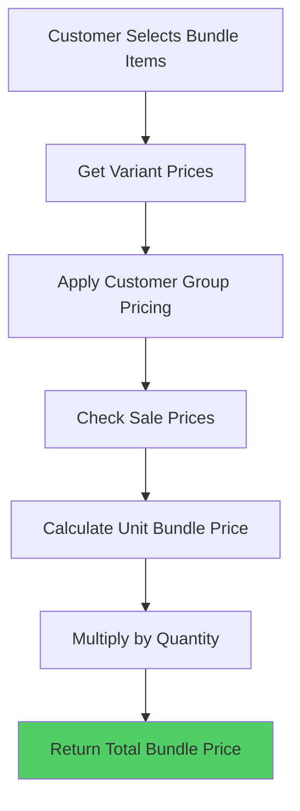

# Bundle Pricing

Bundle pricing calculates the total cost of a bundle based on customer selections from choice sets. The system uses a sum-of-parts pricing model where the bundle price equals the sum of individual variant prices for all selected items.

## Pricing Model

### Sum-of-Parts Pricing

The bundle pricing engine calculates prices using the sum-of-parts approach:

```typescript
bundlePrice = sum(selectedVariantPrices) × bundleQuantity
```

Each variant's price is determined by:
1. **Base Price**: The variant's base price from the product catalog
2. **Price Lists**: Customer group-specific pricing (if applicable)
3. **Sale Prices**: Active sale prices with date ranges
4. **Customer Context**: Customer group membership affects pricing

### Pricing Calculation Flow



## Bundle Price Calculation

### Unit Price Calculation

```typescript
async calculateBundlePrice(
  bundleId: string,
  selections: UserBundleSelection,
  bundleQuantity: number,
  customerId: string | null,
): Promise<number> {
  // Get breakdown of all variants in bundle
  const breakdown = await this.getBundleVariantBreakdown(
    bundleId,
    selections,
    bundleQuantity,
    customerId,
  );

  // Sum all variant prices
  const totalPrice = breakdown.reduce(
    (sum, item) => sum + item.unitPrice * item.quantity,
    0,
  );

  return totalPrice;
}
```

### Variant Breakdown

The system flattens bundle selections into individual variant quantities:

```typescript
interface BundleVariantBreakdown {
  variantId: string;
  unitPrice: number;  // Price per unit
  quantity: number;   // Quantity of this variant in bundle
}
```

### Example Calculation

For a bundle with selections:
- **Set 1**: Selected variant A (price: ₹500)
- **Set 2**: Selected variant B (price: ₹300) and variant C (price: ₹200)
- **Bundle Quantity**: 2

**Calculation**:
```
Unit Bundle Price = ₹500 + ₹300 + ₹200 = ₹1,000
Total Bundle Price = ₹1,000 × 2 = ₹2,000
```

## Customer Group Pricing

Bundle pricing respects customer group pricing rules:

### Price List Application

```typescript
// Customer group pricing is applied automatically
const variantPrice = await pricingService.getVariantPrice(
  variantId,
  customerId,  // null for guest customers
);
```

### Pricing Priority

1. **Sale Price**: Active sale prices take highest priority
2. **Price List Price**: Customer group-specific pricing
3. **Base Price**: Default variant price

## Sale Price Integration

Bundle pricing includes sale price logic:

```typescript
// Sale prices are checked during price calculation
if (variant.salePrice && isSaleActive(variant)) {
  return variant.salePrice;
}
```

### Sale Price Rules

- **Date Range**: Sale prices must be within start/end dates
- **Priority**: Sale prices override price list prices
- **Bundle Items**: Each variant's sale price is applied independently

## Pricing Snapshots

Bundle prices are not frozen at selection time. However, when bundles are added to cart:

1. **Cart Price**: Calculated at add-to-cart time
2. **Checkout Price**: Recalculated during checkout
3. **Order Price**: Frozen in order pricing snapshot

### Price Consistency

- Bundle prices in cart may change if variant prices change
- Checkout recalculates all prices before payment
- Order creation freezes prices in pricing snapshot

## Bundle Pricing Metadata

When bundles are added to cart, pricing metadata is stored:

```typescript
interface BundleCartItemMetadata {
  type: "bundle";
  bundleId: string;
  selections: UserBundleSelection;
  bundleTitle: string;
}
```

### Price Storage

```typescript
// Cart item stores unit bundle price
cartItem.price = unitBundlePrice;  // Price for quantity 1
cartItem.quantity = bundleQuantity;
```

## Discount Application

Bundle pricing works seamlessly with the discount engine. Discounts apply to bundles by flattening them into individual variants.

### How Discounts Apply to Bundles

When a bundle is in the cart, the discount engine:
1. **Flattens Bundle Selections**: Converts bundle selections into individual variant quantities
2. **Applies Product Discounts**: Applies discounts to each variant based on product/category/collection/tag matching
3. **Applies BOGO/Tiered Discounts**: Applies quantity-based discounts to flattened variants
4. **Applies Cart Discounts**: Applies cart-level discounts to the bundle subtotal

### Bundle Flattening for Discounts

```typescript
// Bundle with selections:
// Set 1: Variant A (quantity: 1)
// Set 2: Variant B (quantity: 2)
// Bundle Quantity: 3

// Flattened for discount engine:
const flattenedVariants = [
  { variantId: "variant-a", quantity: 3 },  // 1 × 3 bundles
  { variantId: "variant-b", quantity: 6 },  // 2 × 3 bundles
];
```

### BOGO Discounts with Bundles

**Example**: "Buy 3 Get 1 Free" discount with a bundle of 3 products:

```typescript
// Bundle contains 3 variants (A, B, C)
// Customer adds 2 bundles to cart
// Flattened: 6 units total (2 of each variant)

// BOGO Discount: Buy 3 Get 1 Free
// Applies to: Any 3 items (can be from bundle)
// Result: 1 item free (applied proportionally across variants)
```

**Key Points:**
- BOGO discounts count flattened variants, not bundles
- A bundle of 3 products counts as 3 items for BOGO eligibility
- Discounts apply proportionally across bundle variants

### Discount Calculation Order

1. **Calculate Bundle Base Price**: Sum of variant prices
2. **Flatten Bundle**: Convert to individual variant quantities
3. **Apply Product Discounts**: To each variant based on eligibility
4. **Apply Tiered/BOGO Discounts**: Based on total quantity (flattened)
5. **Apply Cart-Level Discounts**: To bundle subtotal
6. **Calculate Final Price**: After all discounts

### Example: Bundle with BOGO Discount

**Scenario:**
- Bundle: 3 products (A: ₹500, B: ₹300, C: ₹200)
- Bundle Quantity: 2
- BOGO Discount: "Buy 3 Get 1 Free"

**Calculation:**
```
Base Bundle Price: (₹500 + ₹300 + ₹200) × 2 = ₹2,000
Flattened Items: 6 items total (2 of each variant)
BOGO Eligibility: 6 items = 2 sets of "Buy 3 Get 1 Free"
Free Items: 2 items (worth ₹500 + ₹300 = ₹800)
Final Price: ₹2,000 - ₹800 = ₹1,200
```

### Bundle-Level Discounts

Bundle-level discounts can be configured as:
- **Percentage Discount**: e.g., "Save 10% on bundles"
- **Fixed Discount**: e.g., "Save ₹100 on bundles"
- **Tiered Discounts**: Based on bundle value or quantity
- **BOGO Discounts**: Apply to flattened variant quantities

## API Endpoints

### Calculate Bundle Price

```http
POST /storefront/bundles/{bundleId}/calculate-price
Content-Type: application/json

{
  "selections": {
    "set-1": ["variant-a"],
    "set-2": ["variant-b", "variant-c"]
  },
  "quantity": 1
}
```

**Response**:
```json
{
  "unitPrice": 1000,
  "totalPrice": 1000,
  "breakdown": [
    {
      "variantId": "variant-a",
      "unitPrice": 500,
      "quantity": 1
    },
    {
      "variantId": "variant-b",
      "unitPrice": 300,
      "quantity": 1
    },
    {
      "variantId": "variant-c",
      "unitPrice": 200,
      "quantity": 1
    }
  ]
}
```

## Price Display

### Frontend Integration

```typescript
// Calculate bundle price before display
const bundlePrice = await calculateBundlePrice(
  bundleId,
  selections,
  1,  // unit quantity
  customerId,
);

// Display price
displayPrice(bundlePrice);
```

### Real-time Price Updates

- Prices update when customer selections change
- Customer group changes affect pricing
- Sale price activations update bundle prices

## Error Handling

### Missing Variants

If a selected variant is not found:
- **Error**: `Variant not found in bundle`
- **Action**: Validate selections before price calculation

### Price Calculation Failures

If pricing fails:
- **Fallback**: Use base variant prices
- **Logging**: Error logged with context
- **User Feedback**: Clear error message displayed

## Performance Considerations

### Caching

- Variant prices are cached in Redis
- Price list lookups are optimized
- Bundle price calculations are fast (< 50ms)

### Optimization

- Batch variant price lookups
- Parallel price calculations for multiple bundles
- Cache customer group pricing

## Best Practices

1. **Clear Pricing**: Display individual variant prices in bundle UI
2. **Price Updates**: Recalculate on selection changes
3. **Error Handling**: Gracefully handle pricing failures
4. **Performance**: Cache variant prices appropriately
5. **Transparency**: Show price breakdown to customers

## Edge Cases

### Out of Stock Variants

- Price calculation still works for out-of-stock variants
- Inventory check happens separately during add-to-cart
- Prices remain valid even if inventory changes

### Price Changes During Selection

- Prices may change between selection and add-to-cart
- Checkout recalculates all prices
- Order creation freezes prices

### Guest vs Authenticated Pricing

- Guest customers see base/sale prices
- Authenticated customers see customer group prices
- Price differences are transparent

