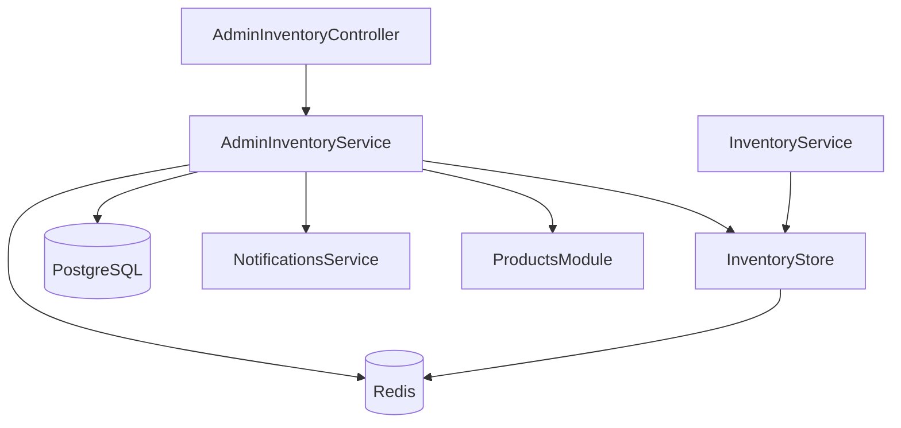

# Inventory Management

The inventory system provides comprehensive real-time stock tracking, reservation management, audit logging, and automatic reconciliation for product variants. It ensures accurate stock levels across high-concurrency operations and prevents overselling through atomic Redis operations and database synchronization.

## Architecture Overview

### Service Architecture

The inventory system is built with a clear separation of concerns:



**Key Components**:

1. **`AdminInventoryService`**: Admin-facing inventory operations
   - Inventory listing and filtering
   - Inventory adjustments (single and bulk)
   - Settings management
   - Health metrics and monitoring
   - Audit log management

2. **`InventoryService`**: Core inventory operations
   - Basic inventory queries
   - System-wide metrics

3. **`InventoryStore`**: Redis-based inventory operations
   - Atomic reservation operations
   - Inventory reconciliation
   - Lua script-based atomic operations

### Dual Storage Strategy

- **PostgreSQL**: Authoritative source for inventory levels and audit trail
- **Redis**: High-performance cache for real-time operations and reservations
- **Synchronization**: Database updates propagate to Redis atomically

## Redis Key Patterns

```typescript
// Available inventory per variant
inventory:variant:{variantId} → quantity

// Reserved (committed) inventory per variant
inventory:reserved:{variantId} → quantity

// Individual reservations (with TTL)
inventory:reservation:{cartId}:{variantId} → quantity

// Checkout locks
inventory:checkout:lock:{checkoutId}:{variantId} → timestamp

// Heartbeat for active reservations
inventory:heartbeat:{cartId}:{variantId} → timestamp
```

## Inventory Concepts

### Inventory States

- **Total Inventory**: Total stock available in the system (stored in database)
- **Committed**: Inventory reserved by active carts/checkouts (stored in Redis)
- **Available**: `Total Inventory - Committed` (calculated in real-time)

### Low Stock Management

- **Global Threshold**: Default low stock threshold for all variants
- **Per-Variant Overrides**: Custom thresholds for specific variants
- **Low Stock Detection**: Automatic flagging when `available <= threshold`

## API Endpoints

### List Inventory

Get paginated inventory list with search, filters, and sorting.

```http
GET /api/v1/admin/inventory?page=1&limit=20&search=TSHIRT&lowStock=true&sortBy=inventory&sortOrder=desc
Authorization: Bearer <token>
```

**Query Parameters**:
- `page`: Page number (default: 1)
- `limit`: Items per page (default: 20, max: 100)
- `search`: Search by SKU or product title
- `status`: Filter by product status (`active`, `draft`, `archived`)
- `categoryId`: Filter by category
- `lowStock`: Filter to show only low stock items
- `outOfStock`: Filter to show only out of stock items
- `sortBy`: Sort field (`inventory`, `committed`, `updatedAt`)
- `sortOrder`: Sort direction (`asc`, `desc`)

**Response**:
```json
{
  "items": [
    {
      "variantId": "123e4567-e89b-12d3-a456-426614174000",
      "productId": "789e4567-e89b-12d3-a456-426614174000",
      "sku": "TSHIRT-BLACK-M",
      "title": "Classic T-Shirt",
      "attributes": {
        "size": "M",
        "color": "Black"
      },
      "inventory": 100,
      "committed": 15,
      "available": 85,
      "lowStock": false,
      "updatedAt": "2025-01-15T10:30:00Z"
    }
  ],
  "pagination": {
    "page": 1,
    "limit": 20,
    "total": 1250,
    "totalPages": 63
  }
}
```

### Get Variant Inventory Details

Get detailed inventory information for a specific variant.

```http
GET /api/v1/admin/inventory/:variantId
Authorization: Bearer <token>
```

**Response**:
```json
{
  "variantId": "123e4567-e89b-12d3-a456-426614174000",
  "productId": "789e4567-e89b-12d3-a456-426614174000",
  "sku": "TSHIRT-BLACK-M",
  "title": "Classic T-Shirt",
  "attributes": {
    "size": "M",
    "color": "Black"
  },
  "inventory": 100,
  "committed": 15,
  "available": 85,
  "lowStockThreshold": 10,
  "lowStock": false,
  "lastAdjustment": {
    "id": "adj-123",
    "type": "increase",
    "delta": 50,
    "reason": "received",
    "createdAt": "2025-01-10T08:00:00Z",
    "actorAdminId": "admin-123"
  },
  "updatedAt": "2025-01-15T10:30:00Z"
}
```

### Adjust Inventory

Perform atomic inventory adjustment with full audit logging.

```http
POST /api/v1/admin/inventory/:variantId/adjust
Content-Type: application/json
Authorization: Bearer <token>

{
  "type": "increase",
  "quantity": 50,
  "reason": "received",
  "note": "Received new stock shipment"
}
```

**Adjustment Types**:
- `increase`: Add inventory
- `decrease`: Remove inventory
- `set`: Set inventory to specific value

**Adjustment Reasons**:
- `received`: New stock received
- `correction`: Inventory correction
- `damaged`: Damaged items
- `lost`: Lost items
- `returned`: Returned items
- `giveaway`: Promotional giveaways
- `manual`: Manual adjustment

**Response**:
```json
{
  "id": "adj-123",
  "variantId": "123e4567-e89b-12d3-a456-426614174000",
  "oldQuantity": 50,
  "newQuantity": 100,
  "delta": 50,
  "type": "increase",
  "reason": "received",
  "note": "Received new stock shipment",
  "actorAdminId": "admin-123",
  "createdAt": "2025-01-15T10:30:00Z"
}
```

**Atomic Operation**:
- Database transaction creates adjustment record
- Redis inventory updated atomically
- Database variant inventory synchronized
- Audit trail maintained

### Bulk Adjust Inventory

Perform bulk inventory adjustments for multiple variants.

```http
POST /api/v1/admin/inventory/bulk-adjust
Content-Type: application/json
Authorization: Bearer <token>

{
  "adjustments": [
    {
      "sku": "TSHIRT-BLACK-M",
      "type": "increase",
      "quantity": 50,
      "reason": "received",
      "note": "Incoming stock"
    },
    {
      "sku": "TSHIRT-BLACK-L",
      "type": "set",
      "quantity": 100,
      "reason": "correction",
      "note": "Stock count correction"
    }
  ]
}
```

**Response**:
```json
{
  "results": [
    {
      "sku": "TSHIRT-BLACK-M",
      "success": true,
      "variantId": "123e4567-e89b-12d3-a456-426614174000",
      "oldQuantity": 50,
      "newQuantity": 100,
      "delta": 50,
      "adjustmentId": "adj-123"
    },
    {
      "sku": "TSHIRT-BLACK-L",
      "success": true,
      "variantId": "456e4567-e89b-12d3-a456-426614174000",
      "oldQuantity": 75,
      "newQuantity": 100,
      "delta": 25,
      "adjustmentId": "adj-124"
    }
  ],
  "summary": {
    "total": 2,
    "successful": 2,
    "failed": 0
  }
}
```

### Get Inventory Logs

Get paginated audit logs for inventory adjustments.

```http
GET /api/v1/admin/inventory/:variantId/logs?page=1&limit=20&dateFrom=2025-01-01&dateTo=2025-01-31&reason=received
Authorization: Bearer <token>
```

**Query Parameters**:
- `page`: Page number
- `limit`: Items per page
- `dateFrom`: Start date (ISO format)
- `dateTo`: End date (ISO format)
- `actorAdminId`: Filter by admin who made adjustment
- `reason`: Filter by adjustment reason
- `type`: Filter by adjustment type
- `orderId`: Filter by related order ID
- `refundId`: Filter by related refund ID

**Response**:
```json
{
  "logs": [
    {
      "id": "adj-123",
      "variantId": "123e4567-e89b-12d3-a456-426614174000",
      "oldQuantity": 50,
      "newQuantity": 100,
      "delta": 50,
      "type": "increase",
      "reason": "received",
      "note": "Received new stock shipment",
      "actorAdminId": "admin-123",
      "actorAdminEmail": "admin@example.com",
      "orderId": null,
      "refundId": null,
      "createdAt": "2025-01-15T10:30:00Z"
    }
  ],
  "pagination": {
    "page": 1,
    "limit": 20,
    "total": 150,
    "totalPages": 8
  }
}
```

### Get Variant Reservations

Get real-time Redis reservation information for a variant.

```http
GET /api/v1/admin/inventory/:variantId/reservations
Authorization: Bearer <token>
```

**Response**:
```json
{
  "variantId": "123e4567-e89b-12d3-a456-426614174000",
  "totalCommitted": 15,
  "reservations": [
    {
      "cartId": "cart-123",
      "quantity": 5,
      "expiresAt": "2025-01-15T11:00:00Z",
      "ttl": 1800
    },
    {
      "cartId": "cart-456",
      "quantity": 10,
      "expiresAt": "2025-01-15T11:15:00Z",
      "ttl": 2700
    }
  ]
}
```

### Inventory Settings

#### Get Settings

```http
GET /api/v1/admin/inventory/settings
Authorization: Bearer <token>
```

**Response**:
```json
{
  "globalLowStockThreshold": 10,
  "perVariantOverrides": {
    "variant-123": 5,
    "variant-456": 20
  }
}
```

#### Update Settings

```http
POST /api/v1/admin/inventory/settings
Content-Type: application/json
Authorization: Bearer <token>

{
  "globalLowStockThreshold": 15,
  "perVariantOverrides": {
    "variant-123": 5
  }
}
```

### Inventory Metrics

#### System Metrics

```http
GET /api/v1/admin/inventory/metrics
Authorization: Bearer <token>
```

**Response**:
```json
{
  "totalAvailable": 125000,
  "totalReserved": 5000,
  "reservedRatio": 0.04,
  "expiredReservationsCount": 12,
  "failedReservationsCount": 3,
  "variantsCount": 1250
}
```

#### Health Dashboard

```http
GET /api/v1/admin/inventory/health
Authorization: Bearer <token>
```

**Response**:
```json
{
  "totalStock": 125000,
  "availableStock": 120000,
  "committedStock": 5000,
  "lowStockCount": 45,
  "outOfStockCount": 12,
  "fastestMovingSkus": [
    {
      "variantId": "variant-123",
      "sku": "TSHIRT-BLACK-M",
      "movementRate": 0.15
    }
  ],
  "slowestMovingSkus": [
    {
      "variantId": "variant-456",
      "sku": "HAT-RED",
      "movementRate": 0.001
    }
  ]
}
```

#### Cart State Metrics

```http
GET /api/v1/admin/inventory/cart-state-metrics
Authorization: Bearer <token>
```

**Response**:
```json
{
  "fresh": 150,
  "stale": 25,
  "reacquired": 10,
  "committed": 5,
  "staleRecoveryRate": 0.4
}
```

#### Reservations Summary

```http
GET /api/v1/admin/inventory/reservations/summary
Authorization: Bearer <token>
```

**Response**:
```json
{
  "totalCommitted": 5000,
  "variantsWithReservations": 125,
  "averageReservationPerVariant": 40,
  "maxReservation": 500
}
```

### Variants Index

Get quick SKU/variant map for bulk actions and dropdowns.

```http
GET /api/v1/admin/inventory/variants/index
Authorization: Bearer <token>
```

**Response**:
```json
{
  "variants": [
    {
      "variantId": "123e4567-e89b-12d3-a456-426614174000",
      "sku": "TSHIRT-BLACK-M",
      "title": "Classic T-Shirt - Black - M"
    }
  ]
}
```

## Reservation Lifecycle

### 1. Cart Addition

When a customer adds items to cart, inventory is reserved:

```typescript
// Reserve inventory atomically using Lua script
await inventoryStore.reserveInventory(cartId, variantId, quantity, ttl);
```

**Process**:
- Check available inventory
- Reserve quantity atomically
- Set TTL for automatic expiration
- Update committed count

### 2. Reservation Management

- **TTL**: Reservations expire after configurable time (default: 30 minutes)
- **Extension**: TTL refreshed on cart updates
- **Heartbeat**: Active reservations send heartbeat signals
- **Cleanup**: Expired reservations automatically release inventory

### 3. Order Completion

When payment succeeds, reservation is committed:

```typescript
// Convert reservation to consumed inventory
await inventoryStore.commitReservation(variantId, quantity);
```

**Process**:
- Remove reservation
- Decrease available inventory
- Update committed count
- Create inventory adjustment record

### 4. Cart Abandonment

When cart expires or is abandoned:

```typescript
// Release reservation back to available inventory
await inventoryStore.releaseInventory(variantId, quantity);
```

**Process**:
- Remove reservation
- Decrease committed count
- Inventory becomes available again

## Atomic Operations

### Lua Scripts

All critical inventory operations use Lua scripts for atomicity:

1. **`reserve-inventory.lua`**: Atomically reserve inventory
2. **`release-inventory.lua`**: Atomically release reservation
3. **`commit-reservation.lua`**: Atomically commit reservation
4. **`validate-inventory.lua`**: Validate inventory availability
5. **`reacquire-inventory.lua`**: Reacquire stale reservations

**Benefits**:
- **Race Condition Prevention**: Single-threaded Lua execution
- **Consistency**: All-or-nothing operations
- **Performance**: Minimal Redis round trips
- **Atomicity**: No partial updates

### Example: Reserve Inventory Script

```lua
-- Reserve inventory atomically
local available = redis.call('GET', inventory_key)
local reserved = redis.call('GET', reserved_key) or 0

if not available or tonumber(available) < quantity + tonumber(reserved) then
    return {'err', 'INSUFFICIENT_INVENTORY', available}
end

redis.call('INCRBY', reserved_key, quantity)
redis.call('SETEX', reservation_key, ttl, quantity)
redis.call('SETEX', heartbeat_key, ttl, timestamp)

return {'ok', available - quantity - tonumber(reserved)}
```

## Inventory Reconciliation

### Automatic Recovery

Runs on application startup and periodically (every 7 minutes) to:

1. **Detect Expired Reservations**
   - Find reservations without valid TTL
   - Release orphaned inventory

2. **Fix Inconsistencies**
   - Compare aggregated vs individual reservations
   - Correct mismatched counts

3. **Handle Edge Cases**
   - Negative inventory corrections
   - Impossible states (reserved > total)
   - Stale heartbeat cleanup

### Reconciliation Process

```typescript
async reconcileReservations(): Promise<ReconciliationResult> {
  // 1. Scan for active reservations
  // 2. Check for orphaned reservations (no TTL/heartbeat)
  // 3. Compare aggregated vs individual counts
  // 4. Fix negative/invalid states
  // 5. Release expired reservations
  // 6. Update metrics
}
```

**Reconciliation Results**:
- Released reservations count
- Inconsistencies fixed
- Orphaned reservations cleaned
- Negative corrections applied

## Business Logic

### Inventory Constraints

- **Non-negative**: Inventory cannot be negative after adjustment
- **Atomic Updates**: All operations are atomic (DB + Redis)
- **Reservation Limits**: Cannot reserve more than available
- **Audit Trail**: All changes logged with actor and reason

### Order Processing Flow

1. **Pre-check**: Verify inventory availability before checkout
2. **Reserve**: Hold inventory during checkout (with TTL)
3. **Commit**: Consume inventory on payment success
4. **Rollback**: Release reservation on payment failure
5. **Reacquire**: Reacquire stale reservations during checkout

### Concurrency Handling

- **Optimistic Locking**: Version-based conflict resolution
- **Deadlock Prevention**: Consistent key ordering
- **Timeout Handling**: Automatic cleanup of stale operations
- **Heartbeat System**: Track active reservations

## Performance Optimization

### Redis Configuration

```typescript
// Optimized for inventory operations
{
  maxRetriesPerRequest: 3,
  retryStrategy: (times) => Math.min(times * 50, 2000),
  enableReadyCheck: true,
  lazyConnect: false,
}
```

### Caching Strategy

- **Hot Variants**: Frequently accessed inventory cached in memory
- **Batch Operations**: Bulk inventory updates
- **Connection Pooling**: Efficient Redis connection management
- **Script Caching**: Lua scripts cached by SHA

### Monitoring

- **Operation Latency**: Track Redis command performance
- **Error Rates**: Monitor failed inventory operations
- **Cache Hit Rates**: Optimize frequently accessed data
- **Reconciliation Metrics**: Track reconciliation success/failure

## Error Handling

### Reservation Failures

```typescript
// Insufficient inventory
throw new BadRequestException(
  `Insufficient inventory. Available: ${available}, Requested: ${quantity}`
);

// Script execution errors
throw new Error(`Reservation failed: ${error.message}`);
```

### Recovery Scenarios

- **Redis Connection Loss**: Graceful degradation with database fallback
- **Script Failures**: Transaction rollback and error logging
- **Data Inconsistencies**: Automatic reconciliation and correction
- **Partial Failures**: Bulk operations continue on individual failures

## Integration Points

### Cart System

- Real-time inventory validation
- Reservation management during cart operations
- Automatic cleanup on cart abandonment
- Heartbeat tracking for active carts

### Order Processing

- Inventory commitment on successful payment
- Reservation rollback on payment failure
- Order cancellation inventory restoration
- Refund inventory restoration

### Product Management

- Variant inventory updates
- Bulk inventory operations
- Inventory synchronization with external systems
- Low stock notifications

### Analytics

- Stock level reporting
- Reservation pattern analysis
- Out-of-stock prediction
- Movement rate tracking

## Scalability Considerations

### Horizontal Scaling

- **Redis Cluster**: Distributed inventory storage
- **Sharding**: Variant-based data distribution
- **Replication**: Read replicas for metrics
- **Load Balancing**: Multiple backend instances

### Performance Limits

- **Throughput**: 10,000+ operations/second
- **Latency**: Sub-millisecond inventory checks
- **Consistency**: Strong consistency for critical operations
- **Reconciliation**: Periodic background reconciliation

### Monitoring & Alerting

- **Low Stock Alerts**: Configurable thresholds
- **Reservation Spikes**: Unusual reservation patterns
- **Reconciliation Failures**: Recovery process monitoring
- **Performance Degradation**: Latency and error rate alerts

## Best Practices

### Inventory Management

1. **Regular Reconciliation**: Run periodic consistency checks
2. **Monitor Metrics**: Track inventory health indicators
3. **Handle Edge Cases**: Account for system failures and data corruption
4. **Audit Trail**: Maintain complete audit log for compliance
5. **Settings Management**: Configure appropriate low stock thresholds

### Performance

1. **Cache Warming**: Pre-load frequently accessed inventory
2. **Batch Operations**: Group related inventory updates
3. **Connection Pooling**: Maintain persistent Redis connections
4. **Script Optimization**: Use Lua scripts for atomic operations

### Reliability

1. **Graceful Degradation**: Continue operations during Redis outages
2. **Data Backup**: Regular inventory state snapshots
3. **Audit Logging**: Track all inventory changes for compliance
4. **Error Recovery**: Automatic reconciliation and error handling

### Security

1. **Admin Authentication**: All inventory operations require admin access
2. **Audit Trail**: Track all changes with actor information
3. **Input Validation**: Validate all adjustment inputs
4. **Rate Limiting**: Prevent abuse of inventory endpoints