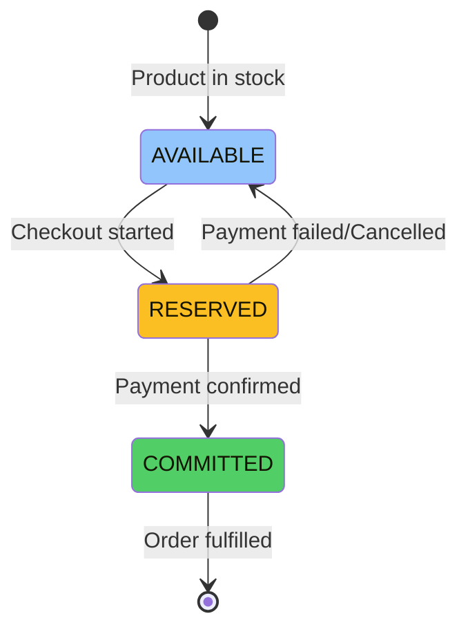
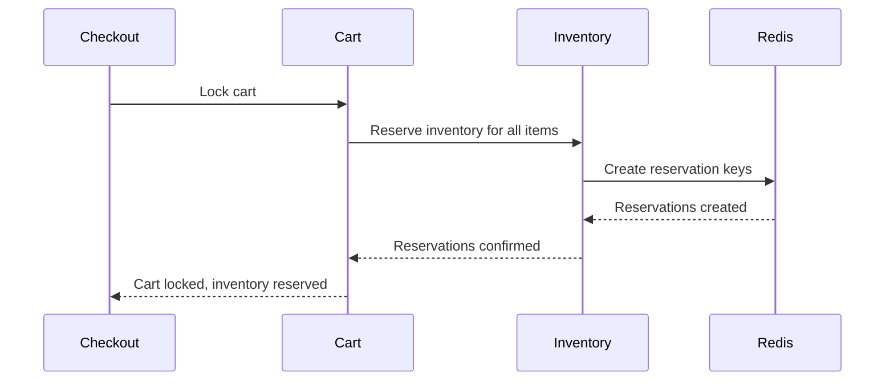
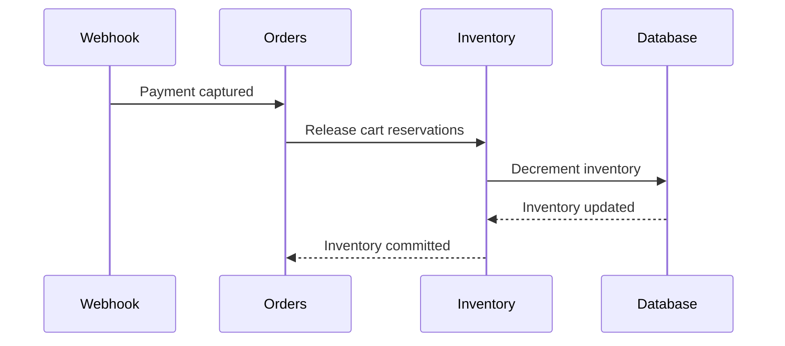

# Checkout Inventory Flow

The inventory flow during checkout ensures that products are reserved when checkout starts and committed when payment is confirmed. This prevents overselling and ensures inventory consistency.

## Inventory Flow Overview

### Flow States



### Inventory States

- **AVAILABLE**: Product available for purchase
- **RESERVED**: Inventory reserved during checkout
- **COMMITTED**: Inventory committed after payment (deducted from stock)

## Reservation Process

### When Reservations Happen

Inventory is reserved when:
1. **Checkout Started**: Cart is locked, inventory reserved
2. **Items Added to Cart**: Inventory reserved immediately (optional, configurable)

### Reservation Flow



### Reservation Implementation

```typescript
async reserveInventory(
  cartId: string,
  variantId: string,
  quantity: number,
): Promise<void> {
  // Check available inventory
  const available = await this.getAvailableInventory(variantId);
  const reserved = await this.getReservedInventory(variantId);
  const actuallyAvailable = available - reserved;

  if (actuallyAvailable < quantity) {
    throw new BadRequestException(
      `Insufficient inventory. Available: ${actuallyAvailable}`
    );
  }

  // Create reservation key
  const reservationKey = `inventory:reservation:${cartId}:${variantId}`;
  
  // Increment reserved count atomically
  await this.client.incrby(`inventory:reserved:${variantId}`, quantity);
  
  // Store individual reservation
  await this.client.set(
    reservationKey,
    quantity.toString(),
    "EX",
    RESERVATION_TTL, // 30 minutes
  );
}
```

## Reservation Storage

### Redis Key Patterns

```typescript
// Individual reservation per cart item
inventory:reservation:{cartId}:{variantId} → quantity

// Aggregated reserved count per variant
inventory:reserved:{variantId} → totalReserved

// Available inventory (from database)
inventory:available:{variantId} → availableCount
```

### Reservation TTL

- **Default TTL**: 30 minutes
- **Auto-Release**: Reservations expire automatically
- **Refresh**: TTL refreshed on cart activity

### Reservation Refresh

```typescript
// Refresh reservation TTL on cart activity
async refreshReservationTTL(cartId: string, variantId: string): Promise<void> {
  const reservationKey = `inventory:reservation:${cartId}:${variantId}`;
  await this.client.expire(reservationKey, RESERVATION_TTL);
}
```

## Inventory Availability Calculation

### Available Inventory Formula

```typescript
availableInventory = totalInventory - reservedInventory - committedInventory
```

### Real-time Availability

```typescript
async getAvailableInventory(variantId: string): Promise<number> {
  // Get total inventory from database
  const total = await this.getTotalInventory(variantId);
  
  // Get reserved inventory from Redis
  const reserved = await this.getReservedInventory(variantId);
  
  // Calculate available
  return Math.max(0, total - reserved);
}
```

### Reserved Inventory Calculation

```typescript
async getReservedInventory(variantId: string): Promise<number> {
  const key = `inventory:reserved:${variantId}`;
  const reserved = await this.client.get(key);
  return reserved ? parseInt(reserved, 10) : 0;
}
```

## Bundle Inventory Reservations

### Bundle Reservation Flow

```typescript
// Flatten bundle selections into variant quantities
const variantQuantities = flattenBundleSelections(
  selections,
  bundleQuantity,
);

// Reserve inventory for each variant
for (const vq of variantQuantities) {
  await this.inventoryStore.reserveInventory(
    cartId,
    vq.variantId,
    vq.quantity,
  );
  
  // Refresh TTL
  await this.inventoryStore.refreshReservationTTL(cartId, vq.variantId);
}
```

### Example Bundle Reservation

For a bundle with:
- Set 1: Variant A (quantity: 1)
- Set 2: Variant B (quantity: 2)
- Bundle Quantity: 2

**Reservations**:
- Variant A: 2 units reserved
- Variant B: 4 units reserved

## Inventory Commit

### When Inventory is Committed

**CRITICAL**: Inventory is committed (decremented) when the order is **PLACED** (created), not when it is delivered. This happens in the `finalizeOrderFromPayment` method after payment confirmation.

Inventory is committed when:
1. **Payment Confirmed**: Payment webhook received
2. **Order Created**: Order creation successful in `finalizeOrderFromPayment`
3. **Inventory Deducted**: Stock reduced permanently at order creation time

**Important Notes:**
- Inventory decrement happens **immediately** when order is created
- Order status changes (including marking as DELIVERED) do **NOT** affect inventory
- If inventory commit fails, the order is still created but inventory won't be decremented (requires manual reconciliation)

### Commit Flow



### Commit Implementation

```typescript
// This happens in finalizeOrderFromPayment after payment confirmation
async commitInventory(orderId: string, cartItems: CartItem[]): Promise<void> {
  try {
    // Release all cart reservations (individual reservation keys)
    await this.inventoryStore.releaseCartReservations(cart.id);

    // Commit reservations for variant items
    for (const item of variantItems) {
      await this.inventoryStore.incrementInventory(
        item.productVariantId,
        -item.quantity,  // Negative to decrement
      );
    }

    // Commit reservations for bundle items (all variants)
    for (const bundleItem of bundleItems) {
      const variantQuantities = flattenBundleSelections(
        bundleItem.metadata.selections,
        bundleItem.quantity,
      );

      for (const vq of variantQuantities) {
        await this.inventoryStore.incrementInventory(
          vq.variantId,
          -vq.quantity,
        );
      }
    }

    // Log successful commit
    logger.info("Inventory successfully decremented for order", { orderId });
  } catch (error) {
    // CRITICAL ERROR: Inventory decrement failed
    // Order is already created, but inventory wasn't decremented
    // This needs to be reconciled manually or via a background job
    logger.error("CRITICAL: Failed to commit inventory for order", {
      orderId,
      error,
      critical: true,
    });
    // Continue - inventory commit failure should be handled separately
    // Order is already created, inventory can be reconciled later
  }
}
```

### Error Handling

**Critical Error Scenario**: If inventory commit fails during order creation:
- Order is still created (payment was successful)
- Inventory is **NOT** decremented
- Error is logged as **CRITICAL** for manual reconciliation
- System continues to prevent blocking order creation

**Reconciliation Required**: Failed inventory commits must be reconciled:
- Manual reconciliation via admin panel
- Background reconciliation job (recommended for production)
- Check logs for orders with `critical: true` inventory errors

## Inventory Release

### When Inventory is Released

Inventory is released when:
1. **Payment Failed**: Payment declined or failed
2. **Checkout Cancelled**: Customer cancels checkout
3. **Reservation Expired**: TTL expired
4. **Cart Cleared**: Cart items removed

### Release Flow

```typescript
async releaseInventory(
  cartId: string,
  variantId: string,
  quantity: number,
): Promise<void> {
  // Decrement reserved count
  await this.client.decrby(
    `inventory:reserved:${variantId}`,
    quantity,
  );

  // Delete individual reservation
  const reservationKey = `inventory:reservation:${cartId}:${variantId}`;
  await this.client.del(reservationKey);
}
```

### Release All Cart Reservations

```typescript
async releaseCartReservations(cartId: string): Promise<void> {
  // Find all reservation keys for this cart
  const pattern = `inventory:reservation:${cartId}:*`;
  const keys = await this.client.keys(pattern);

  // Release each reservation
  for (const key of keys) {
    const quantity = parseInt(await this.client.get(key) || "0", 10);
    const variantId = extractVariantId(key);
    
    // Decrement reserved count
    await this.client.decrby(`inventory:reserved:${variantId}`, quantity);
    
    // Delete reservation key
    await this.client.del(key);
  }
}
```

## Payment Failure Handling

### Inventory Release on Failure

```typescript
async handlePaymentFailure(checkoutSessionId: string): Promise<void> {
  const session = await this.checkoutStore.getSession(checkoutSessionId);
  
  // Release all inventory reservations
  await this.inventoryStore.releaseCartReservations(session.cartId);
  
  // Unlock cart
  await this.checkoutStore.releaseCheckoutLock(session.cartId);
  
  // Update checkout state
  await this.checkoutStore.transitionState(
    checkoutSessionId,
    CheckoutState.FAILED,
  );
}
```

## Inventory Reconciliation

### Reservation Reconciliation

Periodically reconcile reservations:

```typescript
async reconcileReservations(variantId: string): Promise<void> {
  // Get aggregated reserved count
  const aggregatedReserved = await this.getReservedInventory(variantId);
  
  // Get all individual reservations
  const reservations = await this.getAllReservations(variantId);
  const totalFromReservations = sumReservations(reservations);
  
  // Fix inconsistencies
  if (aggregatedReserved !== totalFromReservations) {
    // Correct aggregated count
    await this.client.set(
      `inventory:reserved:${variantId}`,
      totalFromReservations.toString(),
    );
  }
}
```

## Atomic Operations

### Lua Script for Reservation

```lua
-- Atomic inventory reservation
-- KEYS[1] = inventory:reserved:{variantId}
-- KEYS[2] = inventory:reservation:{cartId}:{variantId}
-- ARGV[1] = quantity
-- ARGV[2] = availableInventory
-- ARGV[3] = ttlSeconds

local reservedKey = KEYS[1]
local reservationKey = KEYS[2]
local quantity = tonumber(ARGV[1])
local available = tonumber(ARGV[2])
local ttl = tonumber(ARGV[3])

-- Get current reserved count
local reserved = tonumber(redis.call('GET', reservedKey) or '0')

-- Check availability
if (available - reserved) < quantity then
  return {'err', 'INSUFFICIENT_INVENTORY', available - reserved}
end

-- Increment reserved count
redis.call('INCRBY', reservedKey, quantity)

-- Create reservation
redis.call('SET', reservationKey, quantity, 'EX', ttl)

return {'ok', quantity}
```

## Error Handling

### Insufficient Inventory

```typescript
if (availableInventory < requiredQuantity) {
  throw new BadRequestException(
    `Insufficient inventory. Available: ${availableInventory}, Required: ${requiredQuantity}`
  );
}
```

### Reservation Failures

```typescript
try {
  await this.reserveInventory(cartId, variantId, quantity);
} catch (error) {
  // Rollback any partial reservations
  await this.releaseInventory(cartId, variantId, quantity);
  throw error;
}
```

## Performance Considerations

### Batch Operations

```typescript
// Reserve inventory for multiple variants
async reserveMultiple(
  cartId: string,
  items: Array<{ variantId: string; quantity: number }>,
): Promise<void> {
  // Use pipeline for batch operations
  const pipeline = this.client.pipeline();
  
  for (const item of items) {
    pipeline.incrby(`inventory:reserved:${item.variantId}`, item.quantity);
    pipeline.set(
      `inventory:reservation:${cartId}:${item.variantId}`,
      item.quantity.toString(),
      "EX",
      RESERVATION_TTL,
    );
  }
  
  await pipeline.exec();
}
```

## Monitoring

### Inventory Metrics

```typescript
// Track inventory operations
inventory_reserved_total: counter
inventory_committed_total: counter
inventory_released_total: counter
inventory_reservation_duration: histogram
```

## Best Practices

1. **Reserve Early**: Reserve inventory when checkout starts
2. **Release Promptly**: Release reservations on payment failure
3. **Atomic Operations**: Use Lua scripts for atomic reservations
4. **Reconciliation**: Periodically reconcile reservations
5. **Error Handling**: Handle reservation failures gracefully

## Edge Cases

### Concurrent Reservations

- Lua scripts ensure atomic operations
- Race conditions handled automatically
- Last reservation wins if inventory insufficient

### Reservation Expiration

- Reservations expire after TTL
- Inventory automatically released
- Customer must restart checkout

### Partial Inventory Available

- Reserve available quantity
- Show clear error message
- Suggest alternatives if possible

