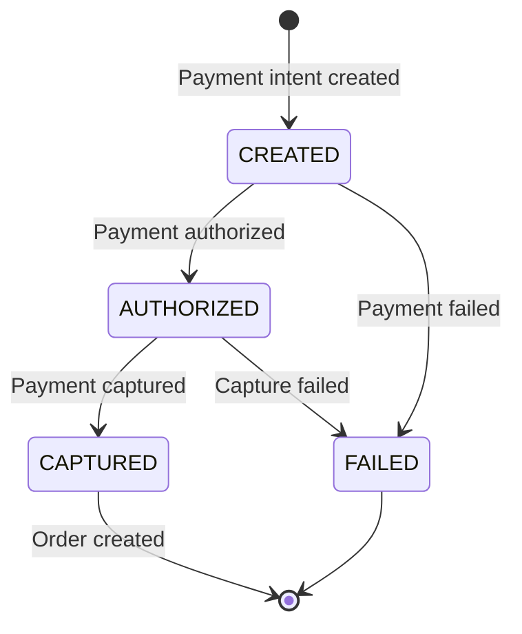
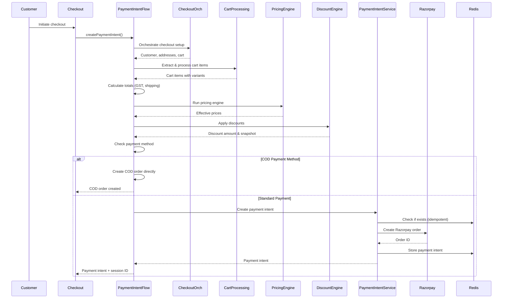

# Payment Intent

Payment intents represent a payment request to the payment gateway (Razorpay). They are created during checkout and serve as the bridge between the checkout session and actual payment processing. **Important**: Orders are created only after payment confirmation via webhook, not during payment intent creation. Cash on Delivery (COD) orders bypass payment intent creation entirely.

## Payment Intent Overview

### What is a Payment Intent?

A payment intent is a record of a payment request that:
- Represents a pending payment transaction
- Links checkout sessions to payment gateway orders
- Ensures idempotent payment processing
- Tracks payment status through webhooks

### Payment Intent Lifecycle



## Payment Intent Creation

### Creation Flow

Payment intent creation is handled by `OrderPaymentIntentFlowService`:



### Relationship with Order Creation

**Key Point**: Payment intent creation does NOT create an order. Orders are created only after payment confirmation via webhook.

1. **Payment Intent Creation** (during checkout):
   - Creates payment intent with Razorpay
   - Stores checkout metadata (customer, addresses, snapshots)
   - Returns payment intent to customer
   - Customer completes payment at gateway

2. **Order Creation** (via webhook):
   - Payment gateway sends webhook on payment capture
   - `OrderPaymentFinalizationService.finalizeOrderFromPayment()` is called
   - Order is created using stored checkout metadata
   - Inventory is committed
   - Cart is cleared

### COD Handling

Cash on Delivery (COD) orders bypass payment intent creation:

```typescript
// In OrderPaymentIntentFlowService.createPaymentIntent()
const isCod = isCodPayment(paymentMethod);

if (isCod) {
  // COD detected - skip payment intent creation
  // Create order directly via OrderCodFlowService
  const codOrder = await this.codFlowService.createCodOrder(
    checkoutSessionId, userId, createOrderDto, sessionId
  );
  
  return {
    paymentIntent: {
      paymentProvider: "cod",
      paymentIntentId: `cod-${codOrder.id}`,
      status: PaymentIntentStatus.CREATED,
    },
    checkoutSessionId,
    orderId: codOrder.id, // Order already created
    message: "COD order created successfully",
  };
}
```

### Idempotent Creation

Payment intents are created idempotently to prevent duplicates:

```typescript
// OrderPaymentIntentService.createPaymentIntent()
async createPaymentIntent(
  checkoutSessionId: string,
  total: number,
  subtotalAfterDiscount: number,
  totalGstAmount: number,
  shippingCost: number,
  paymentFee: number,
  paymentMethod: string | undefined,
  effectiveSubtotal: number,
  discountSnapshot: DiscountSnapshot | null,
  pricingSnapshot: PricingSnapshot | null,
): Promise<PaymentIntent> {
  // Assert checkout state is LOCKED
  await this.checkoutStore.assertState(
    checkoutSessionId,
    CheckoutState.LOCKED,
  );

  // Create or get payment intent atomically
  return await this.checkoutStore.createOrGetPaymentIntent(
    checkoutSessionId,
    async () => {
      // Only called if payment intent doesn't exist
      const amountInPaise = Math.round(total * PAISE_PER_RUPEE);
      
      const razorpayOrder = await this.razorpay.orders.create({
        amount: amountInPaise,  // Amount in paise
        currency: "INR",
        receipt: checkoutSessionId,
        notes: {
          checkoutSessionId,
          order_number: `pending-${Date.now()}`,
          payment_fee: paymentFee.toString(),
          payment_method: paymentMethod || "unknown",
        },
      });

      return {
        paymentProvider: "razorpay",
        paymentIntentId: razorpayOrder.id,
        status: PaymentIntentStatus.CREATED,
        createdAt: new Date().toISOString(),
        updatedAt: new Date().toISOString(),
      };
    },
  );
}
```

## Payment Intent Data Structure

### Payment Intent Entity

```typescript
interface PaymentIntent {
  paymentProvider: "razorpay";
  paymentIntentId: string;  // Razorpay order ID
  status: PaymentIntentStatus;
  createdAt: string;
  updatedAt: string;
}
```

### Payment Intent Status

```typescript
enum PaymentIntentStatus {
  CREATED = "created",        // Payment intent created
  AUTHORIZED = "authorized", // Payment authorized
  CAPTURED = "captured",     // Payment captured
  FAILED = "failed",         // Payment failed
}
```

## Storage in Redis

### Key Patterns

```typescript
// Payment intent by checkout session
payment:intent:{checkoutSessionId} → PaymentIntent

// Reverse lookup: checkout session by payment intent
payment:intent:by-id:{paymentIntentId} → checkoutSessionId
```

### TTL Strategy

- **Payment Intent TTL**: 30 minutes (matches checkout session)
- **Reverse Lookup TTL**: Same as payment intent
- **Automatic Cleanup**: Expired intents cleaned up automatically

## Amount Calculation

### Total Amount Components

```typescript
const amountInPaise = Math.round(
  (subtotalAfterDiscount + totalGstAmount + shippingCost) * 100
) + paymentFee;
```

**Components**:
1. **Subtotal**: Sum of item prices after discounts
2. **GST**: Total GST amount (CGST + SGST or IGST)
3. **Shipping Cost**: Shipping charges
4. **Payment Fee**: Payment gateway fee (in paise)

### Amount Verification

```typescript
// Verify amount includes fee before creating payment intent
const expectedAmount =
  Math.round(
    (subtotalAfterDiscount + totalGstAmount + shippingCost) * 100
  ) + paymentFee;

if (amountInPaise !== expectedAmount) {
  throw new ConflictException(
    "Payment intent amount calculation error - fee must be included"
  );
}
```

## Payment Intent States

### State Transitions

```typescript
CREATED → AUTHORIZED → CAPTURED
   ↓          ↓
FAILED    FAILED
```

### State Meanings

- **CREATED**: Payment intent created, waiting for customer payment
- **AUTHORIZED**: Payment authorized by customer, awaiting capture
- **CAPTURED**: Payment captured successfully, order can be created
- **FAILED**: Payment failed or was declined

## Atomic Creation with Lua Script

### Lua Script Purpose

Prevents race conditions during concurrent payment intent creation:

```lua
-- Atomic payment intent creation
-- KEYS[1] = payment:intent:{checkoutSessionId}
-- KEYS[2] = payment:intent:by-id:{paymentIntentId}
-- ARGV[1] = paymentIntentJson
-- ARGV[2] = checkoutSessionId
-- ARGV[3] = ttlSeconds

local intentKey = KEYS[1]
local reverseLookupKey = KEYS[2]
local paymentIntentJson = ARGV[1]
local checkoutSessionId = ARGV[2]
local ttlSeconds = tonumber(ARGV[3])

-- Check if payment intent already exists
local existing = redis.call('GET', intentKey)
if existing then
  return {'ok', 'EXISTS', existing}
end

-- Create atomically using SET NX
local created = redis.call('SET', intentKey, paymentIntentJson, 'EX', ttlSeconds, 'NX')
if created == 'OK' then
  redis.call('SET', reverseLookupKey, checkoutSessionId, 'EX', ttlSeconds)
  return {'ok', 'CREATED', paymentIntentJson}
else
  local concurrent = redis.call('GET', intentKey)
  if concurrent then
    return {'ok', 'EXISTS', concurrent}
  else
    return {'err', 'RACE_CONDITION'}
  end
end
```

## Payment Intent Retrieval

### Get by Checkout Session

```typescript
async getPaymentIntent(
  checkoutSessionId: string,
): Promise<PaymentIntent | null> {
  const key = `payment:intent:${checkoutSessionId}`;
  const data = await this.client.get(key);
  return data ? JSON.parse(data) : null;
}
```

### Get by Payment Intent ID

```typescript
async getCheckoutSessionByPaymentIntent(
  paymentIntentId: string,
): Promise<string | null> {
  const reverseKey = `payment:intent:by-id:${paymentIntentId}`;
  return await this.client.get(reverseKey);
}
```

## Integration with Razorpay

### Razorpay Order Creation

```typescript
const razorpayOrder = await this.razorpay.orders.create({
  amount: amountInPaise,  // Amount in paise (smallest currency unit)
  currency: "INR",
  receipt: checkoutSessionId,  // Unique receipt ID
  notes: {
    checkoutSessionId,
    order_number: `pending-${Date.now()}`,
    payment_fee: paymentFee.toString(),
    payment_method: paymentMethod || "unknown",
  },
});
```

### Razorpay Order Response

```typescript
{
  id: "order_abc123",  // Payment intent ID
  entity: "order",
  amount: 100000,  // Amount in paise
  amount_paid: 0,
  amount_due: 100000,
  currency: "INR",
  receipt: "checkout-session-123",
  status: "created",
  attempts: 0,
  created_at: 1234567890
}
```

## Payment Intent Updates

### Status Updates via Webhooks

Payment intent status is updated when webhooks are received. When payment is captured, the order is created:

```typescript
// Payment captured webhook handler
case "payment.captured":
  await this.handlePaymentCaptured(webhookEvent);
  // 1. Updates payment intent status to CAPTURED
  // 2. Calls OrderPaymentFinalizationService.finalizeOrderFromPayment()
  // 3. Creates order from checkout session
  // 4. Commits inventory
  // 5. Clears cart
  break;
```

### Order Creation from Payment Intent

When payment is captured, the webhook handler calls:

```typescript
// In webhook handler
const checkoutSessionId = await this.checkoutStore
  .getCheckoutSessionByPaymentIntent(paymentIntentId);

await this.ordersService.finalizeOrderFromPayment(
  checkoutSessionId,
  paymentIntentId,
  "razorpay",
);

// This delegates to:
// OrderPaymentFinalizationService.finalizeOrderFromPayment()
// Which creates the order using stored checkout metadata
```

### Manual Status Updates

```typescript
async updatePaymentIntentStatus(
  checkoutSessionId: string,
  status: PaymentIntentStatus,
): Promise<void> {
  const intent = await this.getPaymentIntent(checkoutSessionId);
  if (intent) {
    intent.status = status;
    intent.updatedAt = new Date().toISOString();
    await this.setPaymentIntent(checkoutSessionId, intent);
  }
}
```

## Error Handling

### Creation Failures

```typescript
try {
  const paymentIntent = await this.createPaymentIntent(...);
} catch (error) {
  // Handle creation failure
  // Release inventory reservations
  // Unlock cart
  // Return error to client
}
```

### Razorpay Errors

```typescript
// Common Razorpay errors
- "Invalid amount" → Amount validation failed
- "Invalid currency" → Currency not supported
- "Order creation failed" → Razorpay API error
```

## Payment Intent Cleanup

### Expiration

Payment intents expire after 30 minutes:
- **Automatic**: Redis TTL handles expiration
- **Manual**: Can be cleaned up via admin tools
- **Failed Intents**: Cleaned up after failure handling

### Cleanup Process

```typescript
// Cleanup expired payment intents
async cleanupExpiredIntents(): Promise<void> {
  // Find expired intents
  // Clean up reverse lookups
  // Log cleanup actions
}
```

## API Endpoints

### Create Payment Intent

```http
POST /orders
Content-Type: application/json
X-Session-Id: {session-id}

{
  "email": "customer@example.com",
  "name": "Customer Name",
  "shippingAddressId": "address-123",
  "billingAddressId": "address-123",
  "shippingCost": 50.0
}
```

**Response** (Standard Payment):
```json
{
  "paymentIntent": {
    "paymentProvider": "razorpay",
    "paymentIntentId": "order_abc123",
    "status": "created",
    "createdAt": "2024-01-01T00:00:00Z",
    "updatedAt": "2024-01-01T00:00:00Z"
  },
  "checkoutSessionId": "session-123",
  "message": "Payment intent created. Redirect user to payment gateway."
}
```

**Response** (COD Payment):
```json
{
  "paymentIntent": {
    "paymentProvider": "cod",
    "paymentIntentId": "cod-order-123",
    "status": "created",
    "createdAt": "2024-01-01T00:00:00Z",
    "updatedAt": "2024-01-01T00:00:00Z"
  },
  "checkoutSessionId": "session-123",
  "orderId": "order-123",
  "message": "COD order created successfully"
}
```

**Note**: For COD orders, `orderId` is included in the response since the order is created immediately.

### Get Payment Intent

```http
GET /checkout/sessions/{sessionId}/payment-intent
```

## Security Considerations

### Idempotency

- Payment intents are idempotent per checkout session
- Prevents duplicate payment requests
- Ensures exactly one payment intent per checkout

### Signature Verification

- Webhook signatures verified before processing
- Payment intent updates only via verified webhooks
- Prevents unauthorized status changes

## Best Practices

1. **Idempotent Creation**: Always check for existing payment intent
2. **Amount Verification**: Verify amount includes all fees
3. **Error Handling**: Handle Razorpay errors gracefully
4. **Status Tracking**: Track payment intent status accurately
5. **Cleanup**: Clean up expired/failed payment intents

## Edge Cases

### Concurrent Creation

- Lua script ensures atomic creation
- Only one payment intent created per checkout session
- Concurrent requests return existing intent

### Payment Intent Expiration

- Expired intents cannot be used for payment
- Customer must restart checkout
- Old payment intents cleaned up automatically

### Razorpay Order Already Exists

- Razorpay may return existing order
- System handles gracefully
- Payment intent linked to existing order

