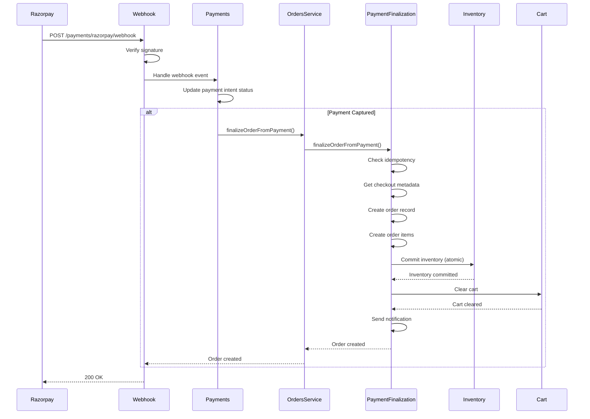
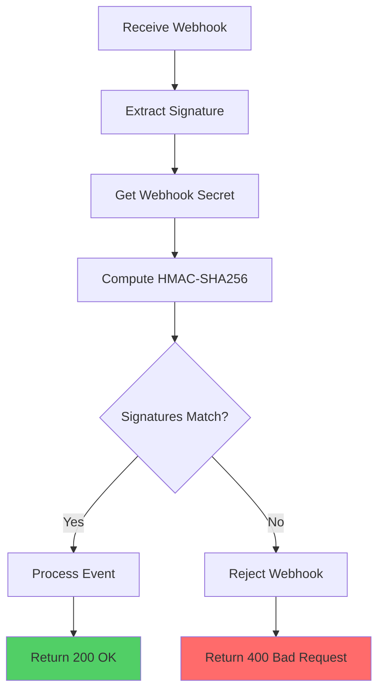
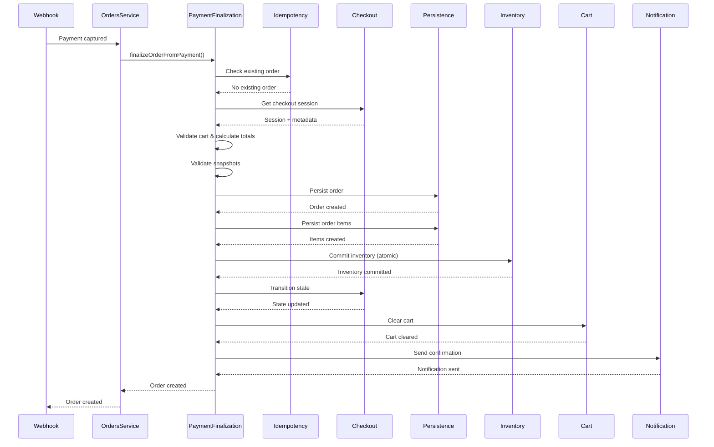
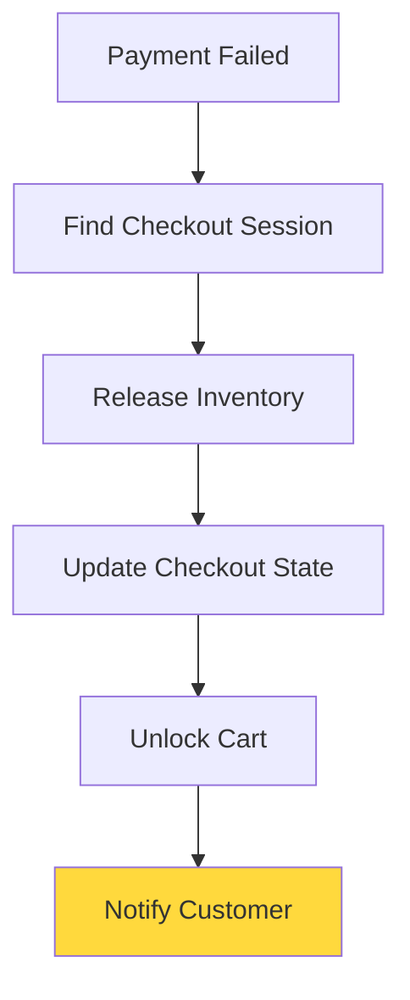

# Checkout Webhooks

Webhooks are HTTP callbacks from payment gateways (Razorpay) that notify the system about payment status changes. They are critical for order creation, inventory management, and payment reconciliation.

## Webhook Overview

### What are Webhooks?

Webhooks are real-time notifications sent by Razorpay when payment events occur:
- **Payment Captured**: Payment successful, order should be created
- **Payment Failed**: Payment declined, inventory should be released
- **Payment Authorized**: Payment authorized, awaiting capture

### Webhook Flow



## Webhook Endpoint

### Endpoint Configuration

```http
POST /storefront/payments/razorpay/webhook
Content-Type: application/json
X-Razorpay-Signature: {signature}
```

### Endpoint Security

```typescript
@Post("razorpay/webhook")
@SetMetadata(IS_PUBLIC_KEY, true)  // Public endpoint
async handleWebhook(
  @Req() req: RawBodyRequest<Request>,
  @Headers("x-razorpay-signature") signature: string,
): Promise<{ processed: boolean; message: string }> {
  // Verify webhook signature
  // Process webhook event
  // Return processing result
}
```

## Signature Verification

### HMAC Signature

Razorpay signs webhooks using HMAC-SHA256:

```typescript
async handleWebhook(
  webhookEvent: RazorpayWebhookEventDto,
  signature: string,
): Promise<{ processed: boolean; message: string }> {
  const webhookSecret = process.env.RAZORPAY_WEBHOOK_SECRET;

  if (!webhookSecret) {
    throw new BadRequestException(
      "Razorpay webhook secret is not configured"
    );
  }

  // Verify webhook signature
  const text = JSON.stringify(webhookEvent);
  const generatedSignature = crypto
    .createHmac("sha256", webhookSecret)
    .update(text)
    .digest("hex");

  if (generatedSignature !== signature) {
    throw new BadRequestException("Invalid webhook signature");
  }

  // Process webhook event
  return this.processWebhookEvent(webhookEvent);
}
```

### Signature Verification Flow



## Webhook Events

### Supported Events

```typescript
enum RazorpayWebhookEvent {
  PAYMENT_CAPTURED = "payment.captured",
  PAYMENT_FAILED = "payment.failed",
  PAYMENT_AUTHORIZED = "payment.authorized",
  ORDER_PAID = "order.paid",
}
```

### Event Processing

```typescript
switch (eventName) {
  case "payment.captured":
    await this.handlePaymentCaptured(webhookEvent);
    break;
  case "payment.failed":
    await this.handlePaymentFailed(webhookEvent);
    break;
  case "payment.authorized":
    await this.handlePaymentAuthorized(webhookEvent);
    break;
  case "order.paid":
    await this.handleOrderPaid(webhookEvent);
    break;
  default:
    return {
      processed: false,
      message: `Event ${eventName} is not handled`,
    };
}
```

## Payment Captured Event

### Event Handler

The webhook handler calls `OrdersService.finalizeOrderFromPayment()`, which delegates to `OrderPaymentFinalizationService`:

```typescript
async handlePaymentCaptured(
  webhookEvent: RazorpayWebhookEventDto,
): Promise<void> {
  const paymentData = webhookEvent.payload.payment.entity;
  const paymentIntentId = paymentData.order_id;  // Razorpay order ID

  // Find checkout session by payment intent ID
  const checkoutSessionId = await this.checkoutStore
    .getCheckoutSessionByPaymentIntent(paymentIntentId);

  if (!checkoutSessionId) {
    this.logger.warn(`Checkout session not found for payment intent ${paymentIntentId}`);
    return;
  }

  // Update payment intent status to CAPTURED
  await this.checkoutStore.updatePaymentIntentStatus(
    checkoutSessionId,
    PaymentIntentStatus.CAPTURED,
  );

  // Create order from checkout session
  // This calls OrderPaymentFinalizationService.finalizeOrderFromPayment()
  await this.ordersService.finalizeOrderFromPayment(
    checkoutSessionId,
    paymentIntentId,
    "razorpay",
  );
}
```

### OrderPaymentFinalizationService Flow

The `OrderPaymentFinalizationService.finalizeOrderFromPayment()` method handles the complete order creation process:

```typescript
// OrderPaymentFinalizationService.finalizeOrderFromPayment()
async finalizeOrderFromPayment(
  checkoutSessionId: string,
  paymentIntentId: string,
  provider: string = "razorpay",
): Promise<OrderResponseDto> {
  // 1. Check payment-scoped idempotency (prevents duplicate orders)
  const existingOrder = await this.idempotencyService.checkExistingOrder(
    checkoutSessionId, paymentIntentId, provider
  );
  if (existingOrder) return existingOrder;
  
  // 2. Get checkout session and validate state (PAYMENT_CONFIRMED)
  const session = await this.checkoutSessionService.getSession(
    checkoutSessionId, CheckoutState.PAYMENT_CONFIRMED
  );
  
  // 3. Get checkout metadata (customer, addresses, snapshots)
  const metadata = await this.checkoutSessionService.getMetadata(checkoutSessionId);
  
  // 4. Validate cart and get cart items
  const cart = await this.cartsService.getCartById(session.cartId);
  const cartItems = await this.cartValidationService.validateAndFetchCartItems(...);
  
  // 5. Calculate totals and validate snapshots
  const totals = await this.totalsCalculationService.calculateTotalsFromCartItems(...);
  const pricingValidation = await this.snapshotValidationService
    .validatePricingSnapshot(checkoutSessionId, metadata.pricingSnapshot, subtotal);
  
  // 6. Persist order
  const persistedOrder = await this.persistenceService.persistOrder(customerId, {...});
  
  // 7. Persist order items
  await this.persistenceService.persistOrderItems(orderId, variantItems, bundleItems, ...);
  
  // 8. Commit inventory atomically (releases reservations + decrements stock)
  await this.inventoryService.commitOrderInventory(
    cart.id, orderId, variantItems, bundleItems, true // clearCheckoutLock = true
  );
  
  // 9. Transition checkout state (PAYMENT_CONFIRMED → ORDER_CREATED → COMPLETED)
  await this.stateTransitionService.completeOrderTransitions(checkoutSessionId, orderId);
  
  // 10. Clear cart
  await this.cartCleanupService.clearCartById(session.cartId);
  
  // 11. Send order confirmation notification
  await this.notificationService.sendOrderConfirmation(...);
  
  return orderResponse;
}
```

### Order Creation Flow



### Idempotency

Order creation is idempotent using payment-scoped idempotency:

```typescript
// OrderIdempotencyService.checkExistingOrder()
// Checks if order already exists for this payment intent
const existingOrder = await this.idempotencyService.checkExistingOrder(
  checkoutSessionId,
  paymentIntentId,
  provider,
);

if (existingOrder) {
  // Order already exists (webhook retry), return it
  return existingOrder;
}

// Create new order
const order = await this.persistenceService.persistOrder(...);
```

**Key Points:**
- Payment-scoped idempotency prevents duplicate orders from same payment intent
- Webhook retries are safe (idempotency check happens first)
- Uses `OrderIdempotencyService` to check for existing orders
- If order exists, returns it immediately without creating duplicate

## Payment Failed Event

### Event Handler

```typescript
async handlePaymentFailed(
  webhookEvent: RazorpayWebhookEventDto,
): Promise<void> {
  const paymentData = webhookEvent.payload.payment.entity;
  const orderId = paymentData.order_id;

  // Find checkout session
  const checkoutSessionId = await this.checkoutStore
    .getCheckoutSessionByPaymentIntent(orderId);

  if (!checkoutSessionId) {
    return;
  }

  // Release inventory reservations
  const session = await this.checkoutStore.getSession(checkoutSessionId);
  await this.inventoryStore.releaseCartReservations(session.cartId);

  // Update checkout state to FAILED
  await this.checkoutStore.transitionState(
    checkoutSessionId,
    CheckoutState.FAILED,
  );

  // Unlock cart
  await this.checkoutStore.releaseCheckoutLock(session.cartId);
}
```

### Failure Handling Flow



## Payment Authorized Event

### Event Handler

```typescript
async handlePaymentAuthorized(
  webhookEvent: RazorpayWebhookEventDto,
): Promise<void> {
  const paymentData = webhookEvent.payload.payment.entity;
  const orderId = paymentData.order_id;

  // Update payment intent status to AUTHORIZED
  const checkoutSessionId = await this.checkoutStore
    .getCheckoutSessionByPaymentIntent(orderId);

  if (checkoutSessionId) {
    await this.checkoutStore.updatePaymentIntentStatus(
      checkoutSessionId,
      PaymentIntentStatus.AUTHORIZED,
    );
  }
}
```

## Order Paid Event

### Event Handler

```typescript
async handleOrderPaid(
  webhookEvent: RazorpayWebhookEventDto,
): Promise<void> {
  // Similar to payment.captured
  // Some payment methods trigger order.paid instead
  await this.handlePaymentCaptured(webhookEvent);
}
```

## Webhook Payload Structure

### Payment Captured Payload

```json
{
  "event": "payment.captured",
  "created_at": 1234567890,
  "payload": {
    "payment": {
      "entity": {
        "id": "pay_abc123",
        "entity": "payment",
        "amount": 100000,
        "currency": "INR",
        "status": "captured",
        "order_id": "order_xyz789",
        "method": "card",
        "created_at": 1234567890
      }
    }
  }
}
```

### Payment Failed Payload

```json
{
  "event": "payment.failed",
  "created_at": 1234567890,
  "payload": {
    "payment": {
      "entity": {
        "id": "pay_abc123",
        "entity": "payment",
        "amount": 100000,
        "currency": "INR",
        "status": "failed",
        "order_id": "order_xyz789",
        "error_code": "BAD_REQUEST_ERROR",
        "error_description": "Payment declined by bank"
      }
    }
  }
}
```

## Idempotency Handling

### Duplicate Prevention

```typescript
// Check if webhook already processed
const webhookId = webhookEvent.id || webhookEvent.created_at;
const processedKey = `webhook:processed:${webhookId}`;

const alreadyProcessed = await this.client.get(processedKey);
if (alreadyProcessed) {
  return {
    processed: true,
    message: "Webhook already processed",
  };
}

// Process webhook
await this.processWebhookEvent(webhookEvent);

// Mark as processed
await this.client.set(processedKey, "1", "EX", 86400); // 24 hours
```

## Error Handling

### Webhook Processing Errors

```typescript
try {
  await this.handleWebhook(webhookEvent, signature);
} catch (error) {
  this.logger.error(
    createErrorContext(this.contextService, "webhook", error, {
      event: webhookEvent.event,
      paymentId: webhookEvent.payload?.payment?.entity?.id,
    }),
    "Webhook processing failed",
  );

  // Return 500 to trigger Razorpay retry
  throw new InternalServerErrorException("Webhook processing failed");
}
```

### Retry Logic

Razorpay retries failed webhooks:
- **Initial Retry**: After 1 minute
- **Subsequent Retries**: Exponential backoff
- **Max Retries**: 5 attempts
- **Final Failure**: Manual reconciliation required

## Webhook Configuration

### Razorpay Dashboard Setup

1. Navigate to Razorpay Dashboard → Settings → Webhooks
2. Add webhook URL: `https://yourdomain.com/storefront/payments/razorpay/webhook`
3. Select events:
   - `payment.captured`
   - `payment.failed`
   - `payment.authorized`
   - `order.paid`
4. Save webhook secret to environment variables

### Environment Variables

```bash
RAZORPAY_WEBHOOK_SECRET=your_webhook_secret_here
```

## Testing Webhooks

### Local Testing

Use tools like ngrok to expose local server:

```bash
ngrok http 3000
# Use ngrok URL in Razorpay webhook configuration
```

### Webhook Testing Tools

- **Razorpay Dashboard**: Test webhook button
- **Postman**: Manual webhook simulation
- **Webhook.site**: Public webhook testing

## Monitoring

### Webhook Metrics

```typescript
// Track webhook processing
webhook_received_total: counter
webhook_processed_total: counter
webhook_failed_total: counter
webhook_processing_duration: histogram
```

### Logging

```typescript
this.logger.info(
  createLogContext(this.contextService, "webhook", {
    event: webhookEvent.event,
    paymentId: paymentData.id,
    orderId: paymentData.order_id,
  }),
  "Webhook processed successfully",
);
```

## Best Practices

1. **Signature Verification**: Always verify webhook signatures
2. **Idempotency**: Handle duplicate webhooks gracefully
3. **Error Handling**: Return appropriate HTTP status codes
4. **Logging**: Log all webhook events for debugging
5. **Monitoring**: Track webhook success/failure rates

## Edge Cases

### Webhook Received Before Payment Intent

- Payment intent may not exist yet
- Log warning and skip processing
- Order creation will happen on next webhook

### Multiple Webhooks for Same Payment

- Use idempotency keys
- Process only once
- Return success for duplicates

### Webhook Timeout

- Razorpay expects 200 OK within 5 seconds
- Process webhook asynchronously if needed
- Return 200 OK immediately, process in background

