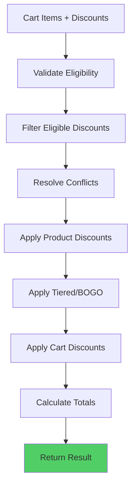

# Discount Engine

## Overview

The discount engine is a pure, deterministic function that applies discounts to cart items based on eligibility, priority, and stacking rules.

## Deterministic Behavior

The discount engine is **deterministic**: same input always produces same output. This ensures:
- Consistent discount application
- Reliable snapshot creation
- Accurate drift detection

## Engine Flow



## Step-by-Step Process

### Step 0: Eligibility Filtering (Pre-Engine)

Before the discount engine runs, discounts are filtered by eligibility using Redis sets for performance. However, if Redis cache is unavailable, the system falls back to direct product/category/collection/tag checks.

#### Redis-Based Eligibility Filtering

```typescript
// Fast path: Use Redis eligibility sets
async filterByEligibility(
  discounts: Discount[],
  cartVariantIds: string[],
): Promise<Discount[]> {
  const eligibleDiscounts = [];
  let hasCacheMiss = false;

  for (const discount of discounts) {
    // Try to get eligibility set from Redis
    const eligibilitySet = await redis.get(
      `discount:eligibility:${discount.id}`,
    );

    if (eligibilitySet) {
      // Check if any cart variant is in eligibility set
      const isEligible = cartVariantIds.some((variantId) =>
        eligibilitySet.includes(variantId),
      );
      if (isEligible) {
        eligibleDiscounts.push(discount);
      }
    } else {
      // Cache miss - include discount for engine filtering
      // Engine will filter based on product/category/collection/tag matching
      hasCacheMiss = true;
      eligibleDiscounts.push(discount);
    }
  }

  return eligibleDiscounts;
}
```

#### Redis Fallback Behavior

**Important**: If Redis eligibility sets are not cached (cold cache, Redis unavailable), discounts are **still included** for engine processing. The discount engine will filter them based on direct product/category/collection/tag matching.

**Benefits:**
- Automatic discounts work even if Redis cache is cold
- No silent failures when Redis is unavailable
- Graceful degradation to direct checks
- System remains functional during Redis outages

#### Direct Eligibility Check (Fallback)

When Redis data is unavailable, the system performs direct checks:

```typescript
// Fallback: Direct product/category/collection/tag check
function isProductEligibleForStandardDiscount(
  discount: Discount,
  variant: CartItem,
): boolean {
  // Check product IDs
  if (discount.productIds?.includes(variant.productId)) {
    return true;
  }

  // Check category IDs
  if (discount.categoryIds?.includes(variant.categoryId)) {
    return true;
  }

  // Check collection IDs
  if (
    discount.collectionIds?.some((cid) =>
      variant.collectionIds.includes(cid),
    )
  ) {
    return true;
  }

  // Check tag IDs
  if (
    discount.tagIds?.some((tid) => variant.tagIds.includes(tid))
  ) {
    return true;
  }

  return false;
}
```

### Step 1: Eligibility Validation

Check each discount against cart:

```typescript
function validateDiscounts(
  cart: Cart,
  discounts: Discount[],
  customer: Customer
): Discount[] {
  return discounts.filter(discount => {
    // Check minimum order value
    if (discount.minOrderValue && cart.subtotal < discount.minOrderValue) {
      return false;
    }
    
    // Check product requirements
    if (discount.requiredProductIds && !hasRequiredProducts(cart, discount.requiredProductIds)) {
      return false;
    }
    
    // Check customer group
    if (discount.customerGroupId && customer.groupId !== discount.customerGroupId) {
      return false;
    }
    
    // Check date range
    if (!isWithinDateRange(discount, now)) {
      return false;
    }
    
    // Check usage limits
    if (hasExceededUsageLimit(discount, customer)) {
      return false;
    }
    
    return true;
  });
}
```

### Step 2: Conflict Resolution

Resolve conflicts between discounts:

```typescript
function resolveConflicts(discounts: Discount[]): ResolvedDiscounts {
  // Sort by priority (ascending: lower = stronger)
  const sorted = discounts.sort((a, b) => a.priority - b.priority);
  
  // Build exclusion graph
  const exclusionMap = buildExclusionMap(sorted);
  
  // Resolve mutually exclusive groups
  const resolved = resolveExclusions(sorted, exclusionMap);
  
  // Apply stacking rules
  const stackable = resolved.filter(d => d.canStack);
  const nonStackable = resolved.filter(d => !d.canStack);
  
  // For non-stackable, only keep highest priority
  const finalNonStackable = nonStackable.length > 0
    ? [nonStackable.reduce((prev, curr) => 
        prev.priority < curr.priority ? prev : curr
      )]
    : [];
  
  return {
    productDiscounts: [...stackable, ...finalNonStackable].filter(isProductDiscount),
    cartDiscounts: [...stackable, ...finalNonStackable].filter(isCartDiscount)
  };
}
```

### Step 3: Apply Product Discounts

Apply discounts to individual line items:

```typescript
function applyProductDiscounts(
  items: CartItem[],
  discounts: Discount[]
): DiscountedLineItem[] {
  return items.map(item => {
    let lineTotal = item.price * item.quantity;
    const appliedDiscounts = [];
    
    // Find applicable discounts for this item
    const applicable = discounts.filter(d => 
      isProductEligible(d, item.productId, item.categoryId, item.collectionIds, item.tagIds)
    );
    
    // Group by stacking compatibility
    const stackable = applicable.filter(d => d.canStack);
    const nonStackable = applicable.filter(d => !d.canStack);
    
    // Apply non-stackable (highest priority only)
    if (nonStackable.length > 0) {
      const highest = nonStackable.reduce((prev, curr) => 
        prev.priority < curr.priority ? prev : curr
      );
      const amount = calculateDiscountAmount(highest, lineTotal);
      lineTotal -= amount;
      appliedDiscounts.push({ discountId: highest.id, amount });
    }
    
    // Apply stackable (all eligible)
    for (const discount of stackable) {
      const amount = calculateDiscountAmount(discount, lineTotal);
      lineTotal -= amount;
      appliedDiscounts.push({ discountId: discount.id, amount });
    }
    
    return {
      ...item,
      lineTotal: Math.max(0, roundToTwoDecimals(lineTotal)),
      discounts: appliedDiscounts
    };
  });
}
```

### Step 4: Apply Tiered/BOGO Discounts

Apply quantity-based discounts:

```typescript
function applyTieredAndBogo(
  items: DiscountedLineItem[],
  discounts: Discount[]
): DiscountedLineItem[] {
  // Apply tiered discounts
  items = applyTieredDiscounts(items, discounts.filter(d => d.type === 'TIERED'));
  
  // Apply BOGO discounts
  items = applyBogoDiscounts(items, discounts.filter(d => d.type === 'BUY_X_GET_Y'));
  
  return items;
}
```

### Step 5: Apply Cart Discounts

Apply discounts to cart subtotal:

```typescript
function applyCartDiscounts(
  subtotal: number,
  discounts: Discount[]
): { cartDiscounts: AppliedCartDiscount[], finalTotal: number } {
  const cartDiscounts = discounts.filter(d => d.scope === 'ORDER');
  let currentTotal = subtotal;
  const applied = [];
  
  // Sort by priority
  const sorted = cartDiscounts.sort((a, b) => a.priority - b.priority);
  
  // Group by stacking
  const stackable = sorted.filter(d => d.canStack);
  const nonStackable = sorted.filter(d => !d.canStack);
  
  // Apply non-stackable (highest priority only)
  if (nonStackable.length > 0) {
    const highest = nonStackable.reduce((prev, curr) => 
      prev.priority < curr.priority ? prev : curr
    );
    const amount = calculateDiscountAmount(highest, currentTotal);
    currentTotal -= amount;
    applied.push({ discountId: highest.id, amount });
  }
  
  // Apply stackable (all eligible)
  for (const discount of stackable) {
    const amount = calculateDiscountAmount(discount, currentTotal);
    currentTotal -= amount;
    applied.push({ discountId: discount.id, amount });
  }
  
  return {
    cartDiscounts: applied,
    finalTotal: Math.max(0, roundToTwoDecimals(currentTotal))
  };
}
```

## Discount Amount Calculation

```typescript
function calculateDiscountAmount(
  discount: Discount,
  amount: number
): number {
  switch (discount.type) {
    case 'PERCENTAGE':
      return roundToTwoDecimals(amount * (discount.value / 100));
    
    case 'FIXED_AMOUNT':
      return Math.min(discount.value, amount);
    
    case 'FIXED_PRICE':
      return Math.max(0, amount - discount.value);
    
    default:
      return 0;
  }
}
```

## Engine Input

```typescript
interface DiscountEngineInput {
  cart: {
    items: Array<{
      id: string;
      productVariantId: string;
      productId: string;
      categoryId: string | null;
      collectionIds: string[];
      tagIds: string[];
      price: number;
      quantity: number;
    }>;
    subtotal: number;
  };
  discounts: Discount[];
  customer: {
    id: string;
    groupId: string | null;
  } | null;
}
```

## Engine Output

```typescript
interface DiscountEngineResult {
  lineItems: DiscountedLineItem[];
  cartDiscounts: AppliedCartDiscount[];
  subtotal: number;
  discountTotal: number;
  total: number;
  appliedDiscountIds: string[];
  breakdown: {
    lineItems: DiscountedLineItem[];
    cartDiscounts: AppliedCartDiscount[];
    stepByStep: Step[];
  };
}
```

## Performance Optimizations

- **Early Filtering**: Filter ineligible discounts before processing
- **Priority Sorting**: Sort once, reuse sorted list
- **Caching**: Cache eligibility results for repeated checks
- **Batch Processing**: Process all items in single pass

## Edge Cases

- **No Eligible Discounts**: Returns cart as-is
- **All Discounts Excluded**: Returns cart as-is
- **Negative Totals**: Clamped to 0
- **Overlapping Discounts**: Priority and stacking rules resolve
- **Expired Discounts**: Filtered out in eligibility check

