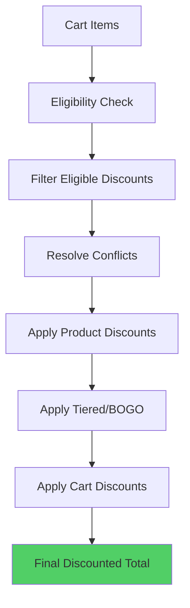

# Discount Engine Overview

## Architecture

The discount engine is a deterministic system that applies discounts to cart items based on eligibility rules, priority, and stacking configurations.

## Key Features

- **Deterministic**: Same input always produces same output
- **Priority-Based**: Lower priority number = higher priority
- **Stacking Support**: Multiple discounts can stack if configured
- **Conflict Resolution**: Handles mutually exclusive discounts
- **Snapshot Versioning**: Immutable discount snapshots for orders
- **Drift Detection**: Monitors discount rule changes

## Discount Types

### Product-Level Discounts

Apply to specific products, categories, collections, or tags:

- **PERCENTAGE**: Percentage off (e.g., 20% off)
- **FIXED_AMOUNT**: Fixed amount off (e.g., ₹100 off)
- **FIXED_PRICE**: Set fixed price (e.g., ₹999)

### Cart-Level Discounts

Apply to entire cart subtotal:

- **PERCENTAGE**: Percentage off subtotal
- **FIXED_AMOUNT**: Fixed amount off subtotal
- **FIXED_PRICE**: Set fixed cart total

### Tiered Discounts

Apply based on quantity thresholds:

- **TIERED**: Different discounts for different quantities
- Example: Buy 2 get 10% off, Buy 5 get 20% off

### BOGO Discounts

Buy X Get Y discounts:

- **BUY_X_GET_Y**: Buy X items, get Y items free/discounted
- Example: Buy 2 Get 1 Free
- **Bundle Support**: BOGO discounts apply to bundles by flattening them into individual variants
  - Example: Bundle of 3 products + "Buy 3 Get 1 Free" = eligible for discount
  - The discount counts flattened variants, not bundles

## Discount Flow



## Eligibility Rules

Discounts can have multiple eligibility conditions:

- **Minimum Order Value**: Cart must meet minimum amount
- **Product Requirements**: Must include specific products
- **Category Requirements**: Must include products from categories
- **Collection Requirements**: Must include products from collections
- **Tag Requirements**: Must include products with tags
- **Customer Group**: Only for specific customer groups
- **Usage Limits**: Per-customer or total usage limits
- **Date Range**: Start and end dates

### Automatic Discount Eligibility

**Redis Fallback Behavior**: Automatic discounts use Redis eligibility sets for fast filtering. However, if Redis cache is unavailable or cold:

- Discounts are **still considered** for eligibility
- System falls back to direct product/category/collection/tag checks
- Automatic discounts continue to work even during Redis outages
- No silent failures when Redis is unavailable

This ensures automatic discounts always work, even if the Redis cache isn't warmed up or is temporarily unavailable.

## Priority System

Discounts are evaluated by priority:

1. **Lower Priority Number** = Higher Priority
2. Priority 1 is evaluated before Priority 10
3. Highest priority discount wins in conflicts

## Stacking Rules

### Stackable Discounts

When `canStack: true`:
- Multiple discounts can apply simultaneously
- All eligible stackable discounts are applied

### Non-Stackable Discounts

When `canStack: false`:
- Only highest priority discount applies
- Other discounts are ignored

## Conflict Resolution

### Mutually Exclusive Discounts

Discounts can exclude other discounts:

```json
{
  "code": "SAVE20",
  "excludedDiscountIds": ["SAVE30", "FLASH50"]
}
```

If SAVE20 is applied, SAVE30 and FLASH50 cannot be applied.

### Resolution Algorithm

1. Sort discounts by priority (ascending)
2. Build exclusion graph
3. Resolve mutually exclusive groups
4. Apply stacking rules
5. Separate product and cart discounts

## Discount Application Order

1. **Product-Level Discounts**: Applied first to individual items
2. **Tiered/BOGO Discounts**: Applied after product discounts
3. **Cart-Level Discounts**: Applied last to subtotal

## Snapshot System

Discounts are snapshotted when orders are created:

- Immutable record of applied discounts
- Used for order history and reconciliation
- Prevents price changes affecting past orders

## Drift Detection

Monitors discount rule changes:

- Detects when discount rules change
- Compares current rules to snapshot rules
- Generates drift reports for admins

## API Endpoints

- `GET /discounts/calculate` - Calculate discounts for cart
- `GET /admin/discounts` - List all discounts
- `POST /admin/discounts` - Create discount
- `GET /admin/discounts/:id` - Get discount
- `PATCH /admin/discounts/:id` - Update discount
- `DELETE /admin/discounts/:id` - Delete discount
- `GET /admin/discounts/drift-report` - Get drift report

## Caching

Discounts are cached in Redis:

- **Cache Key**: `discounts:rules:{hash}`
- **TTL**: 1 hour
- **Invalidation**: On discount create/update/delete

## Performance

- **Deterministic Engine**: Pure function, easily cacheable
- **Redis Caching**: Rules cached for fast lookups
- **Batch Processing**: Processes all cart items efficiently

## Best Practices

1. **Clear Priority**: Use consistent priority numbering
2. **Test Stacking**: Verify stacking behavior works as expected
3. **Monitor Usage**: Track discount code usage and effectiveness
4. **Set Limits**: Use usage limits to prevent abuse
5. **Document Rules**: Document discount rules clearly

