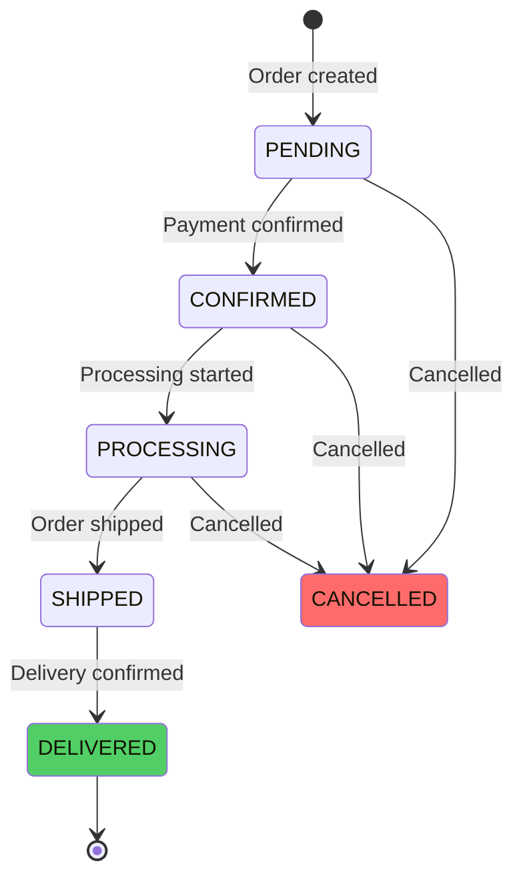
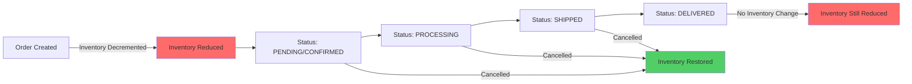
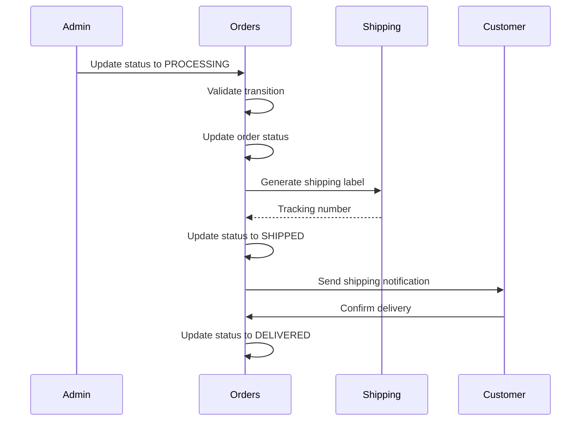

# Order Fulfillment

Order fulfillment manages the complete lifecycle of an order from payment confirmation to delivery. It tracks order status, coordinates shipping, and ensures timely delivery to customers.

## Fulfillment Overview

### Fulfillment States



### Order Status Flow

```typescript
enum OrderStatus {
  PENDING = "pending",      // Order created, payment pending
  CONFIRMED = "confirmed",  // Payment confirmed, ready to process
  PROCESSING = "processing", // Order being prepared
  SHIPPED = "shipped",      // Order shipped to customer
  DELIVERED = "delivered",  // Order delivered successfully
  CANCELLED = "cancelled",  // Order cancelled
  REFUNDED = "refunded",    // Order refunded
}
```

## Inventory Behavior

### Critical: Inventory Decrement Timing

**IMPORTANT**: Inventory is decremented when the order is **PLACED** (created), not when it is delivered or when status changes.

- **Order Created**: Inventory is decremented immediately after payment confirmation in `finalizeOrderFromPayment`
- **Order Cancelled**: Inventory is restored (incremented back) when order is cancelled
- **Order Delivered**: Status change to DELIVERED does **NOT** affect inventory (already decremented)
- **Order Archived**: Archiving does **NOT** affect inventory (just a flag)

### Inventory Flow by Status



## Status Transitions

### Valid Transitions

```typescript
const ORDER_TRANSITIONS = {
  [PENDING]: [CONFIRMED, CANCELLED],
  [CONFIRMED]: [PROCESSING, CANCELLED],
  [PROCESSING]: [SHIPPED, CANCELLED],
  [SHIPPED]: [DELIVERED, CANCELLED],
  [DELIVERED]: [], // Terminal state
  [CANCELLED]: [], // Terminal state
  [REFUNDED]: [],  // Terminal state
};
```

**Note**: Status changes (including DELIVERED) do **NOT** affect inventory. Inventory is only affected at order creation (decrement) and cancellation (restore).

### Transition Validation

```typescript
function validateStatusTransition(
  from: OrderStatus,
  to: OrderStatus,
): boolean {
  // Business rule validation
  if (from === DELIVERED && to === CANCELLED) {
    return false; // Cannot cancel delivered orders
  }

  if (from === REFUNDED) {
    return false; // Cannot change refunded orders
  }

  return ORDER_TRANSITIONS[from]?.includes(to) ?? false;
}
```

## Automatic Status Updates

### Payment Confirmation

```typescript
// Payment webhook triggers status update
async handlePaymentCaptured(webhookEvent: RazorpayWebhookEventDto) {
  // Create order with CONFIRMED status
  const order = await this.createOrderFromCheckout(...);
  
  // Status automatically set to CONFIRMED
  // Ready for processing
}
```

### Status Update Flow



## Manual Status Updates

### Admin Status Update

```http
PATCH /admin/orders/{orderId}/status
Content-Type: application/json

{
  "status": "processing",
  "note": "Order being prepared for shipment"
}
```

### Status Update Implementation

```typescript
async updateOrderStatus(
  orderId: string,
  newStatus: OrderStatus,
  note?: string,
): Promise<OrderResponseDto> {
  // Get current order
  const order = await this.getOrder(orderId);
  
  // Validate transition
  if (!validateStatusTransition(order.status, newStatus)) {
    throw new BadRequestException(
      `Invalid status transition from ${order.status} to ${newStatus}`
    );
  }
  
  // Update order status
  const [updatedOrder] = await db
    .update(orders)
    .set({
      status: newStatus,
      updatedAt: new Date(),
    })
    .where(eq(orders.id, orderId))
    .returning();
  
  // Add timeline event
  await this.timelineService.addEvent(orderId, {
    type: TimelineEventType.STATUS_CHANGED,
    message: `Order status changed to ${newStatus}`,
    metadata: { from: order.status, to: newStatus, note },
  });
  
  return updatedOrder;
}
```

## Processing Stage

### Order Processing

When order status changes to `PROCESSING`:

1. **Inventory Verification**: Verify all items are available
2. **Order Preparation**: Prepare items for shipment
3. **Quality Check**: Perform quality checks
4. **Packaging**: Package items securely
5. **Shipping Label**: Generate shipping label

### Processing Implementation

```typescript
async startProcessing(orderId: string): Promise<void> {
  const order = await this.getOrder(orderId);
  
  // Verify inventory still available
  for (const item of order.items) {
    const available = await this.inventoryStore.getAvailableInventory(
      item.productVariantId,
    );
    
    if (available < item.quantity) {
      throw new BadRequestException(
        `Insufficient inventory for ${item.productVariantId}`
      );
    }
  }
  
  // Update status to PROCESSING
  await this.updateOrderStatus(orderId, OrderStatus.PROCESSING, {
    note: "Order processing started",
  });
}
```

## Shipping Stage

### Shipping Preparation

```typescript
async shipOrder(
  orderId: string,
  shippingData: {
    trackingNumber: string;
    carrier: string;
    shippedAt: Date;
  },
): Promise<void> {
  // Update order status to SHIPPED
  await this.updateOrderStatus(orderId, OrderStatus.SHIPPED, {
    note: `Order shipped via ${shippingData.carrier}`,
  });
  
  // Store shipping information
  await db
    .update(orders)
    .set({
      shippingProvider: shippingData.carrier,
      shippingTrackingNumber: shippingData.trackingNumber,
      shippedAt: shippingData.shippedAt,
    })
    .where(eq(orders.id, orderId));
  
  // Send shipping notification
  await this.notificationsService.sendShippingNotification(orderId);
}
```

### Shipping Label Generation

```typescript
async generateShippingLabel(orderId: string): Promise<ShippingLabel> {
  const order = await this.getOrder(orderId);
  
  // Generate label via shipping provider API
  const label = await this.shippingProvider.generateLabel({
    orderId: order.orderNumber,
    address: order.shippingAddress,
    items: order.items,
    weight: calculateWeight(order.items),
  });
  
  return label;
}
```

## Delivery Confirmation

### Delivery Update

```typescript
async confirmDelivery(
  orderId: string,
  deliveryData: {
    deliveredAt: Date;
    signature?: string;
    notes?: string;
  },
): Promise<void> {
  // Update order status to DELIVERED
  // NOTE: This does NOT affect inventory - inventory was already decremented when order was created
  await this.updateOrderStatus(orderId, OrderStatus.DELIVERED, {
    note: "Order delivered successfully",
  });
  
  // Store delivery information
  await db
    .update(orders)
    .set({
      deliveredAt: deliveryData.deliveredAt,
      deliverySignature: deliveryData.signature,
      deliveryNotes: deliveryData.notes,
    })
    .where(eq(orders.id, orderId));
  
  // Send delivery confirmation
  await this.notificationsService.sendDeliveryConfirmation(orderId);
  
  // Enable reviews for delivered items
  await this.reviewsService.enableReviewsForOrder(orderId);
}
```

**Important**: Marking an order as DELIVERED only updates the order status. It does **NOT** decrement inventory, as inventory was already decremented when the order was created.

## Fulfillment Controls

### Admin Fulfillment UI

```typescript
interface FulfillmentControlsProps {
  currentStatus: OrderStatus;
  onStatusChange: (status: OrderStatus) => void;
}

// Get next valid status
function getNextStatus(currentStatus: OrderStatus): OrderStatus | null {
  switch (currentStatus) {
    case "pending":
      return "confirmed";
    case "confirmed":
      return "processing";
    case "processing":
      return "shipped";
    case "shipped":
      return "delivered";
    default:
      return null;
  }
}
```

## Timeline Events

### Fulfillment Timeline

```typescript
interface TimelineEvent {
  id: string;
  orderId: string;
  type: TimelineEventType;
  message: string;
  metadata?: {
    status?: OrderStatus;
    trackingNumber?: string;
    carrier?: string;
  };
  createdAt: Date;
}
```

### Automatic Timeline Updates

```typescript
// Status change events
await this.timelineService.addEvent(orderId, {
  type: TimelineEventType.STATUS_CHANGED,
  message: `Order status changed to ${newStatus}`,
  metadata: { from: oldStatus, to: newStatus },
});

// Shipping events
await this.timelineService.addEvent(orderId, {
  type: TimelineEventType.SHIPPED,
  message: `Order shipped via ${carrier}`,
  metadata: { trackingNumber, carrier },
});

// Delivery events
await this.timelineService.addEvent(orderId, {
  type: TimelineEventType.DELIVERED,
  message: "Order delivered successfully",
  metadata: { deliveredAt },
});
```

## Shipping Integration

### Shipping Providers

```typescript
interface ShippingProvider {
  generateLabel(order: Order): Promise<ShippingLabel>;
  trackShipment(trackingNumber: string): Promise<TrackingInfo>;
  calculateShipping(address: Address, items: OrderItem[]): Promise<number>;
}
```

### Shipping Label

```typescript
interface ShippingLabel {
  trackingNumber: string;
  carrier: string;
  labelUrl: string;
  estimatedDelivery: Date;
}
```

## Notifications

### Shipping Notification

```typescript
async sendShippingNotification(orderId: string): Promise<void> {
  const order = await this.getOrder(orderId);
  
  await this.notificationsService.send({
    type: NotificationType.ORDER_SHIPPED,
    recipient: order.customer.email,
    data: {
      orderNumber: order.orderNumber,
      trackingNumber: order.shippingTrackingNumber,
      carrier: order.shippingProvider,
      estimatedDelivery: order.estimatedDelivery,
    },
  });
}
```

### Delivery Notification

```typescript
async sendDeliveryConfirmation(orderId: string): Promise<void> {
  const order = await this.getOrder(orderId);
  
  await this.notificationsService.send({
    type: NotificationType.ORDER_DELIVERED,
    recipient: order.customer.email,
    data: {
      orderNumber: order.orderNumber,
      deliveredAt: order.deliveredAt,
    },
  });
}
```

## API Endpoints

### Update Order Status

```http
PATCH /admin/orders/{orderId}/status
Content-Type: application/json

{
  "status": "processing",
  "note": "Order being prepared"
}
```

### Ship Order

```http
POST /admin/orders/{orderId}/ship
Content-Type: application/json

{
  "trackingNumber": "TRACK123456",
  "carrier": "BlueDart",
  "shippedAt": "2024-12-18T10:00:00Z"
}
```

### Confirm Delivery

```http
POST /admin/orders/{orderId}/deliver
Content-Type: application/json

{
  "deliveredAt": "2024-12-20T14:30:00Z",
  "signature": "Customer Signature",
  "notes": "Delivered to reception"
}
```

## Order Cancellation

### Cancellation Flow

When an order is cancelled, inventory is **restored** (incremented back) to available stock:

```typescript
async cancelOrder(orderId: string, cancelDto: CancelOrderDto): Promise<void> {
  // Release inventory back to available stock
  await this.releaseInventory(orderId);
  
  // Update order status to CANCELLED
  await this.updateOrderStatus(orderId, OrderStatus.CANCELLED, {
    note: cancelDto.reason,
  });
  
  // Process refund if payment was captured
  if (paymentCaptured) {
    await this.processRefund(orderId, cancelDto);
  }
}
```

### Inventory Restoration

```typescript
private async releaseInventory(orderId: string): Promise<void> {
  // Get order items
  const items = await this.db
    .select()
    .from(orderItems)
    .where(eq(orderItems.orderId, orderId));

  for (const item of items) {
    // Check if item has bundle metadata
    if (item.metadata?.type === "bundle" && item.metadata.selections) {
      // Handle bundle items - release inventory for all variants in bundle
      const variantQuantities = flattenBundleSelections(
        item.metadata.selections,
        item.quantity,
      );

      for (const vq of variantQuantities) {
        await this.inventoryStore.incrementInventory(
          vq.variantId,
          vq.quantity, // Positive value to add back to inventory
        );
      }
    } else {
      // Regular variant item
      await this.inventoryStore.incrementInventory(
        item.productVariantId,
        item.quantity, // Positive value to add back to inventory
      );
    }
  }
}
```

**Important**: 
- Cancellation restores inventory that was decremented when order was created
- Both regular variants and bundle items are handled correctly
- Inventory restoration happens before order status is updated to CANCELLED

## Error Handling

### Invalid Status Transition

```typescript
if (!validateStatusTransition(currentStatus, newStatus)) {
  throw new BadRequestException(
    `Cannot transition from ${currentStatus} to ${newStatus}`
  );
}
```

### Shipping Failures

```typescript
try {
  await this.shipOrder(orderId, shippingData);
} catch (error) {
  // Log error
  // Notify admin
  // Keep order in PROCESSING status
}
```

## Best Practices

1. **Status Validation**: Always validate status transitions
2. **Timeline Tracking**: Record all status changes
3. **Notifications**: Notify customers at each stage
4. **Error Handling**: Handle shipping failures gracefully
5. **Monitoring**: Track fulfillment metrics

## Edge Cases

### Partial Shipment

- Handle partial shipments for multi-item orders
- Track shipped vs pending items
- Update order status accordingly

### Delivery Failure

- Handle failed delivery attempts
- Update order status appropriately
- Notify customer and admin

### Status Rollback

- Some statuses can be rolled back
- Validate rollback rules
- Update timeline accordingly

