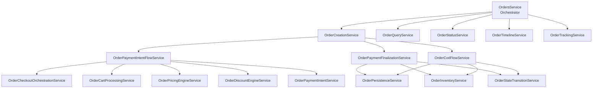
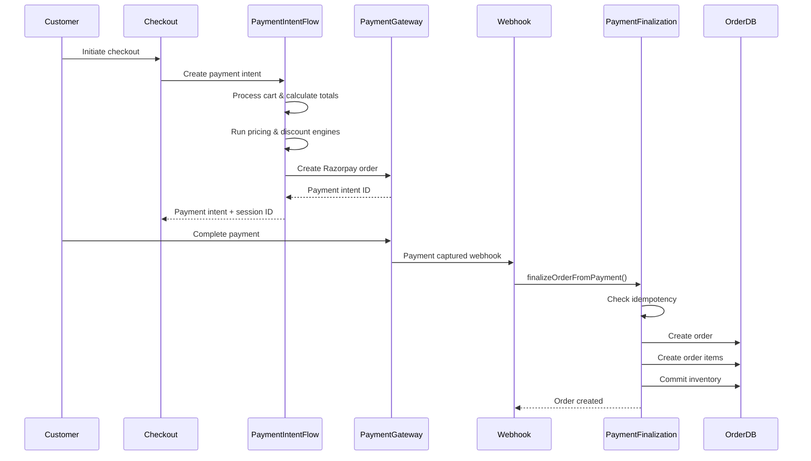

# Orders System

The orders system manages the complete lifecycle of customer orders from creation to fulfillment. It integrates with checkout, payments, inventory, and shipping systems to provide a seamless order processing experience.

## Order Architecture

The orders module uses a service-oriented architecture with specialized services organized by domain. This separation of concerns enables better maintainability, testability, and scalability.

### Service Architecture

The orders module is organized into specialized services:

**Orchestration Layer:**
- `OrdersService` - Thin orchestrator that delegates to specialized services (no business logic, only coordination)

**Creation Services:**
- `OrderCreationService` - Coordinates order creation flows
- `OrderPaymentIntentFlowService` - Handles payment intent creation during checkout
- `OrderPaymentFinalizationService` - Handles order creation from payment webhook
- `OrderCodFlowService` - Handles Cash on Delivery (COD) order creation

**Query Services:**
- `OrderQueryService` - Handles order retrieval and filtering
- `OrderEnrichmentService` - Enriches order data with related entities
- `OrderResponseBuilderService` - Builds order response DTOs

**Status Services:**
- `OrderStatusService` - Manages order status transitions
- `OrderTimelineService` - Manages order timeline events
- `OrderTrackingService` - Provides order tracking information

**Domain Services (organized by domain):**
- `services/calculation/` - Order total calculations and GST computation
- `services/cart/` - Cart processing and validation
- `services/checkout/` - Checkout orchestration and session management
- `services/discount/` - Discount application and validation
- `services/pricing/` - Pricing engine integration
- `services/payment/` - Payment intent handling
- `services/persistence/` - Database operations
- `services/snapshot/` - Pricing and discount snapshot management
- `services/inventory/` - Inventory operations and reservations
- `services/validation/` - Order validation logic

### Service Interaction Diagram



### Core Components
- **Order Creation**: Webhook-driven order creation after payment confirmation
- **Payment Intent Creation**: Separate flow for creating payment intents during checkout
- **COD Flow**: Dedicated flow for Cash on Delivery orders that bypasses payment intent
- **Order Lifecycle**: Status tracking and state management
- **Order Items**: Detailed line items with pricing and metadata
- **Order Timeline**: Audit trail of all order events
- **Order Reconciliation**: Synchronization with external systems

### Order States

```typescript
enum OrderStatus {
  PENDING = "pending",      // Order created, payment pending
  CONFIRMED = "confirmed",  // Payment confirmed, processing can begin
  PROCESSING = "processing", // Order being prepared for shipment
  SHIPPED = "shipped",      // Order shipped to customer
  DELIVERED = "delivered",  // Order delivered successfully
  CANCELLED = "cancelled",  // Order cancelled
  REFUNDED = "refunded",    // Order refunded
}
```

## Order Data Structure

### Order Entity
```typescript
interface Order {
  id: string;
  customerId: string;
  orderNumber: string;     // Unique human-readable order number
  status: OrderStatus;
  subtotal: number;        // Sum of item prices before tax/discount
  gstAmount: number;       // Total GST amount
  discountCode?: string;   // Applied discount code
  discountAmount: number;  // Total discount applied
  shippingCost: number;    // Shipping charges
  total: number;          // Final order total
  razorpayOrderId?: string; // Payment gateway reference
  shippingProvider?: string; // Shipping service used
  shippingAddressId: string;
  billingAddressId: string;
  discountSnapshot: DiscountSnapshot; // Frozen discount rules
  pricingSnapshot: PricingSnapshot;   // Frozen pricing data
  createdAt: Date;
  updatedAt: Date;
}
```

### Order Item Entity
```typescript
interface OrderItem {
  id: string;
  orderId: string;
  productVariantId: string;
  quantity: number;
  price: number;          // Unit price at time of order
  gstRate: number;        // GST rate applied
  gstAmount: number;      // GST amount for this item
  metadata: any;          // Bundle selections, customizations
  createdAt: Date;
  updatedAt: Date;
}
```

## Order Creation Process

### Payment Intent Flow (Standard Orders)

For standard orders, the process is split into two phases:

**Phase 1: Payment Intent Creation** (during checkout)
1. Customer initiates checkout
2. System orchestrates checkout setup (customer, addresses, cart)
3. System processes cart items and calculates totals
4. System runs pricing engine to get effective prices
5. System applies discount engine to calculate discounts
6. System creates payment intent with Razorpay
7. System stores checkout metadata (customer, addresses, snapshots)
8. Customer completes payment at gateway

**Phase 2: Order Finalization** (via webhook)
1. Payment gateway sends webhook on payment capture
2. System retrieves checkout session and metadata
3. System validates payment-scoped idempotency
4. System creates order record with atomic transaction
5. System creates order items from cart
6. System commits inventory (releases reservations and decrements stock)
7. System transitions checkout state to ORDER_CREATED
8. System clears cart
9. System sends order confirmation notification

### COD Flow (Cash on Delivery)

COD orders skip payment intent creation and go directly to order creation:

1. Customer selects COD as payment method during checkout
2. System detects COD payment method
3. System orchestrates checkout setup (customer, addresses, cart)
4. System processes cart items and calculates totals
5. System runs pricing and discount engines
6. System stores checkout metadata
7. System creates order directly (no payment intent)
8. System creates COD payment record
9. System commits inventory
10. System transitions checkout state (LOCKED → PAYMENT_CONFIRMED → ORDER_CREATED → COMPLETED)
11. System clears cart
12. System sends order confirmation notification

### Order Creation Flow Diagram



### Order Number Generation
```typescript
// Format: ORD-YYYYMMDD-XXXXX (e.g., ORD-20241218-00001)
function generateOrderNumber(): string {
  const date = new Date().toISOString().slice(0, 10).replace(/-/g, '');
  const sequence = await getNextOrderSequence();
  return `ORD-${date}-${sequence.toString().padStart(5, '0')}`;
}
```

## Order Lifecycle Management

### Status Transitions

#### Valid Transitions
```typescript
const ORDER_TRANSITIONS = {
  [PENDING]: [CONFIRMED, CANCELLED],
  [CONFIRMED]: [PROCESSING, CANCELLED],
  [PROCESSING]: [SHIPPED, CANCELLED],
  [SHIPPED]: [DELIVERED, CANCELLED],
  [DELIVERED]: [], // Terminal state
  [CANCELLED]: [], // Terminal state
  [REFUNDED]: [],  // Terminal state
};
```

#### Automatic Transitions
- **PENDING → CONFIRMED**: Payment confirmation webhook
- **CONFIRMED → PROCESSING**: Manual admin action
- **PROCESSING → SHIPPED**: Shipping label generation
- **SHIPPED → DELIVERED**: Delivery confirmation

### Status Update Validation
```typescript
function validateStatusTransition(from: OrderStatus, to: OrderStatus): boolean {
  // Business rule validation
  if (from === DELIVERED && to === CANCELLED) {
    return false; // Cannot cancel delivered orders
  }

  if (from === REFUNDED) {
    return false; // Cannot change refunded orders
  }

  return ORDER_TRANSITIONS[from]?.includes(to) ?? false;
}
```

## Order Timeline & Audit Trail

### Timeline Events
```typescript
enum TimelineEventType {
  CREATED = "created",
  STATUS_CHANGED = "status_changed",
  PAYMENT_RECEIVED = "payment_received",
  SHIPPED = "shipped",
  DELIVERED = "delivered",
  CANCELLED = "cancelled",
  REFUNDED = "refunded",
  NOTE_ADDED = "note_added",
}

interface TimelineEvent {
  id: string;
  orderId: string;
  type: TimelineEventType;
  message: string;
  metadata?: any;
  createdBy?: string; // User/admin who triggered event
  createdAt: Date;
}
```

### Automatic Timeline Updates
```typescript
async addTimelineEvent(orderId: string, event: TimelineEvent): Promise<void> {
  // Store in database with full audit trail
  // Trigger notifications if needed
  // Update order updated_at timestamp
}
```

## Pricing & Discount Integration

### Snapshot Storage
Orders store immutable snapshots of pricing and discount rules:

```typescript
interface OrderPricingData {
  discountSnapshot: {
    engineVersion: string;
    timestamp: string;
    rules: DiscountRule[];
    ruleHash: string;
    appliedDiscounts: AppliedDiscount[];
  };
  pricingSnapshot: {
    engineVersion: string;
    timestamp: string;
    variants: Map<string, VariantPricing>;
    ruleHash: string;
  };
}
```

### Historical Accuracy
- **Frozen Pricing**: Order totals remain accurate even if prices change
- **Refund Calculations**: Use original pricing for refunds
- **Audit Compliance**: Complete pricing history maintained

## Inventory Integration

### Order Creation
```typescript
async createOrderItems(orderId: string, cartItems: CartItem[]): Promise<void> {
  for (const item of cartItems) {
    // 1. Validate inventory availability
    // 2. Commit reserved inventory
    // 3. Create order item record
    // 4. Update variant inventory
  }
}
```

### Order Cancellation
```typescript
async cancelOrder(orderId: string): Promise<void> {
  // 1. Validate cancellation eligibility
  // 2. Restore inventory to available pool
  // 3. Update order status
  // 4. Process refund if needed
  // 5. Add timeline event
}
```

## Payment Integration

### Payment Status Sync
```typescript
async updatePaymentStatus(orderId: string, paymentData: PaymentWebhook): Promise<void> {
  // Update payment records
  // Transition order status based on payment outcome
  // Handle payment failures and retries
  // Update timeline with payment events
}
```

### Refund Processing
```typescript
async processRefund(orderId: string, refundAmount: number): Promise<void> {
  // Validate refund eligibility
  // Process partial or full refunds
  // Update order status to REFUNDED
  // Restore inventory if applicable
  // Add refund timeline event
}
```

## Shipping Integration

### Shipment Creation
```typescript
async createShipment(orderId: string, shipmentData: ShipmentInfo): Promise<void> {
  // Generate shipping label
  // Update tracking information
  // Transition to SHIPPED status
  // Send shipping notification
}
```

### Delivery Confirmation
```typescript
async confirmDelivery(orderId: string, deliveryData: DeliveryInfo): Promise<void> {
  // Update delivery timestamp
  // Transition to DELIVERED status
  // Send delivery confirmation
  // Update customer order history
}
```

## Order Search & Filtering

### Advanced Search
```typescript
interface OrderSearchFilters {
  customerId?: string;
  status?: OrderStatus[];
  orderNumber?: string;
  dateRange?: { start: Date; end: Date };
  minTotal?: number;
  maxTotal?: number;
  paymentStatus?: PaymentStatus[];
  shippingStatus?: ShippingStatus[];
}
```

### Search Capabilities
- **Order Number**: Exact and partial matching
- **Customer Search**: By name, email, or ID
- **Date Filtering**: Creation and delivery date ranges
- **Amount Filtering**: Order total ranges
- **Status Filtering**: Multiple status combinations

## API Endpoints

### Order Management
```http
# Get customer orders
GET /storefront/orders?status=confirmed&page=1&limit=20

# Get single order details
GET /storefront/orders/{orderId}

# Get order timeline
GET /storefront/orders/{orderId}/timeline

# Cancel order (if eligible)
POST /storefront/orders/{orderId}/cancel

# Request refund
POST /storefront/orders/{orderId}/refund
{
  "amount": 500,
  "reason": "Damaged product"
}
```

### Admin Operations
```http
# List all orders with filters
GET /admin/orders?status=processing&customerId=123&limit=50

# Update order status
PATCH /admin/orders/{orderId}/status
{
  "status": "shipped",
  "note": "Order shipped via BlueDart"
}

# Add order note
POST /admin/orders/{orderId}/notes
{
  "note": "Customer requested gift wrapping",
  "isPublic": false
}

# Process refund
POST /admin/orders/{orderId}/refund
{
  "amount": 1000,
  "reason": "Size mismatch",
  "initiatePaymentRefund": true
}
```

## Order Reconciliation

### Automated Reconciliation
```typescript
async reconcileOrders(): Promise<ReconciliationResult> {
  // 1. Check for orders stuck in processing
  // 2. Validate payment status consistency
  // 3. Verify inventory consumption
  // 4. Identify missing shipments
  // 5. Generate reconciliation report
}
```

### Reconciliation Types
- **Payment Reconciliation**: Match payments with order status
- **Inventory Reconciliation**: Verify stock consumption
- **Shipping Reconciliation**: Match shipments with orders
- **Status Reconciliation**: Identify inconsistent state transitions

## Performance Optimization

### Database Optimization
```sql
-- Optimized indexes for common queries
CREATE INDEX CONCURRENTLY orders_status_created_at_idx
ON orders(status, created_at DESC);

CREATE INDEX CONCURRENTLY order_items_order_id_quantity_idx
ON order_items(order_id, quantity);
```

### Caching Strategy
- **Order Details**: Cached with TTL based on status
- **Order Lists**: Paginated results cached
- **Order Search**: Search results cached with invalidation
- **Order Timeline**: Timeline events cached per order

### Query Optimization
- **Batch Operations**: Bulk order status updates
- **Lazy Loading**: Order items loaded on demand
- **Pagination**: Efficient large dataset handling
- **Index Usage**: Optimized query execution plans

## Monitoring & Analytics

### Order Metrics
```typescript
// Order conversion metrics
order_conversion_rate: gauge
order_average_value: gauge
order_cancellation_rate: gauge

// Processing time metrics
order_processing_duration: histogram
order_shipping_duration: histogram
order_delivery_duration: histogram

// Status distribution
order_status_distribution: gauge
```

### Business Intelligence
```typescript
// Customer behavior
repeat_customer_rate: gauge
average_order_frequency: gauge
customer_lifetime_value: gauge

// Product performance
best_selling_products: gauge
product_return_rate: gauge
inventory_turnover: gauge
```

## Security & Compliance

### Data Protection
- **PII Handling**: Customer data encrypted and access controlled
- **Audit Trail**: Complete order history with user attribution
- **Retention Policy**: Configurable data retention periods
- **Access Control**: Role-based order access permissions

### Fraud Prevention
- **Order Validation**: Comprehensive order data validation
- **Payment Verification**: Multi-layer payment confirmation
- **Address Validation**: Shipping and billing address verification
- **Rate Limiting**: Order creation rate limiting

## Error Handling & Recovery

### Order Creation Failures
```typescript
async handleOrderCreationFailure(checkoutId: string, error: Error): Promise<void> {
  // 1. Rollback inventory reservations
  // 2. Cancel payment intent
  // 3. Mark checkout as failed
  // 4. Notify customer of failure
  // 5. Log detailed error information
}
```

### Status Transition Failures
```typescript
async handleStatusTransitionFailure(orderId: string, error: Error): Promise<void> {
  // 1. Validate current order state
  // 2. Attempt retry with exponential backoff
  // 3. Manual intervention queue for complex cases
  // 4. Alert administrators for critical failures
}
```

## Integration Points

### External Systems
- **Payment Gateway**: Razorpay integration for payments
- **Shipping Providers**: Integration with multiple carriers
- **Email Service**: Order confirmations and updates
- **SMS Service**: Delivery notifications
- **Inventory Systems**: External warehouse integration

### Internal Systems
- **Checkout System**: Seamless checkout to order conversion
- **Inventory System**: Real-time stock management
- **Discount Engine**: Dynamic pricing and promotions
- **Customer Service**: Order management and support

## Best Practices

### Order Processing
1. **Atomic Operations**: All order creation steps succeed or fail together
2. **Idempotent Updates**: Safe retry of failed operations
3. **Status Validation**: Strict state transition rules
4. **Error Recovery**: Comprehensive failure handling and recovery

### Performance
1. **Efficient Queries**: Optimized database access patterns
2. **Smart Caching**: Appropriate cache invalidation strategies
3. **Batch Processing**: Bulk operations for high volume
4. **Resource Management**: Proper connection pooling and cleanup

### Monitoring
1. **Comprehensive Logging**: Detailed audit trail for all operations
2. **Performance Tracking**: Monitor and optimize slow operations
3. **Error Alerting**: Proactive issue detection and resolution
4. **Business Metrics**: Track key performance indicators

### Compliance
1. **Data Privacy**: GDPR and privacy regulation compliance
2. **Audit Requirements**: Complete transaction history
3. **Fraud Detection**: Advanced fraud prevention measures
4. **Security Standards**: Industry-standard security practices
